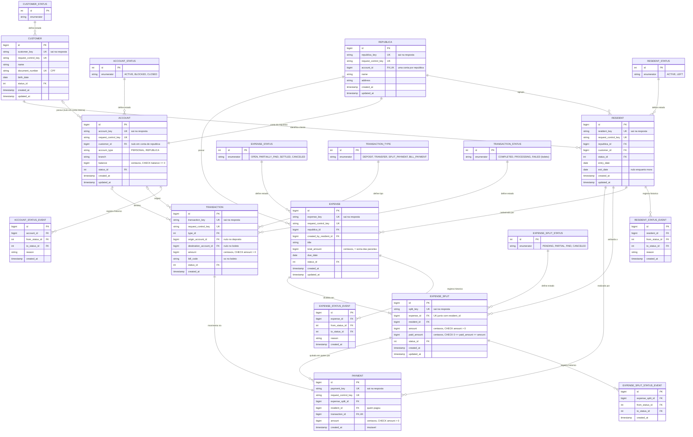

# RFC — ReP+, a solução para sua república!

| | |
|---|---|
| **Time** | Leonardo Bonfá Schroeder · Guilherme Vicente Ramalho |
| **Data** | 13/10/2026 |
| **Versão** | 4 |

## Contextualização

### Entendendo o problema

O sistema oferece uma plataforma de banco digital e gestão financeira para repúblicas estudantis e moradias compartilhadas que não necessariamente possuem CNPJ e, portanto, não têm acesso a contas bancárias jurídicas conjuntas. Cada usuário possui uma conta individual, podendo consultar saldo e extrato, receber depósitos, transferir para outras contas do sistema e pagar contas por boleto. A plataforma também permite criar repúblicas virtuais, com conta própria, para cadastrar despesas comuns, definir rateios igualitários ou ponderados, registrar pagamentos (inteiros ou em partes) e acompanhar a quitação de cada integrante. O sistema deve garantir que nenhum valor seja criado, perdido ou contabilizado duas vezes: o depósito é a única porta de entrada de dinheiro, transações duplicadas devem ser impedidas, falhas não podem gerar registros parciais ou divergentes e o histórico deve reconstruir exatamente os saldos. Os rateios e pagamentos devem permanecer consistentes com os valores registrados, e nenhum morador sai da república devendo. Estão fora do escopo contas bancárias conjuntas tradicionais com CNPJ, investimentos, operações de crédito, empréstimos e seguros.

### Explicando a solução de forma macro

O sistema se apoia em três blocos (bancário, doméstico e rateio). O bancário é genérico: cliente, conta e transação, todo movimento de dinheiro é uma linha com origem, destino e valor em centavos, e o saldo é uma coluna atualizada na mesma transação de banco que grava o movimento. O doméstico tem a república, com conta própria, e o morador, que liga um cliente a ela; como a casa não tem CNPJ, essa conta é interna ao sistema. O terceiro é o rateio: a despesa da casa vira uma parcela por morador, igualitária ou ponderada, quitada por um ou mais pagamentos. O pagamento é a costura entre os dois mundos, porque aponta ao mesmo tempo para a parcela e para a transação que moveu o dinheiro, e daí sai a garantia da seção anterior: parcela não é quitada sem transação, transação não existe fora do extrato, e tudo que uma operação escreve vale junto ou não vale, num único commit. Toda requisição que cria algo traz uma `request_control_key`, gravada com `UNIQUE` no mesmo commit, para que repetir a requisição nunca mova dinheiro duas vezes.

O que foi considerado e descartado:

- **Crédito ao morador ou à república** — descartado porque não é a dor que o grupo se propõe a resolver: o problema da república é dividir e cobrar o que já foi gasto, não antecipar dinheiro. Traria análise de limite, juros e inadimplência, e a casa nem tem personalidade jurídica a quem conceder crédito. Ganharia se o produto virasse uma conta para o morador, não para a casa.
- **Exigir que a república abra uma conta jurídica com CNPJ** — descartado porque não é o que acontece na vida real: repúblicas são arranjos informais, com moradores entrando e saindo todo semestre, e abrir CNPJ para dividir a conta de luz é um custo que ninguém paga. Ganharia para moradias formais, como pensões e coliving.
- **Saldo calculado somando as transações, sem coluna `balance`** — descartado porque cada pagamento teria que somar o histórico inteiro da conta, e o custo cresce com o tempo. Ganharia com poucas transações por conta e auditoria mais importante que velocidade. A coluna tem um preço: o saldo e a transação precisam ser gravados no mesmo commit.
- **Trava otimista (coluna de versão e nova tentativa em caso de conflito)** — descartada porque, com dinheiro disputado, o conflito é justamente o caso que precisa dar certo, e esperar a trava é mais simples do que tentar de novo. Ganharia se os conflitos fossem raros e as leituras muito mais frequentes que as escritas.

## Implementação

### Rotas

Toda rota, exceto `POST /customers`, recebe o cabeçalho `X-Customer-Key`, que traz a identidade já validada pela borda. Quando o recurso pedido não pertence a quem pede, a resposta é `404`, e não `403`, para não confirmar que o recurso existe (R8). Saldo insuficiente e regra de negócio violada saem como `422`; conflito de estado ou chave reaproveitada com dados diferentes saem como `409`; formato inválido sai como `400`.

| Método | Caminho | O que faz | Entrada (campos que importam) | Saídas (status e quando) |
|---|---|---|---|---|
| `POST` | `/customers` | Cria um novo cliente. | `request_control_key`, `name`, `document_number`, `birth_date` | `201` cliente criado com a key; `400` schema inválido; `409` CPF já cadastrado ou `request_control_key` usada com outros dados; `422` CPF com dígito verificador inválido. **Idempotente:** `UNIQUE` em `customer.request_control_key`; a repetição devolve o cliente já criado, com `201`. |
| `GET` | `/customers/{customer_key}` | Busca os dados do cliente. | *(só path)* | `200` cliente retornado; `404` não existe ou não é quem pede. |
| `POST` | `/accounts` | Cria uma conta pessoal para o cliente. Contas de república são criadas só por `POST /republicas`. | `request_control_key`, `customer_key` | `201` conta criada com a key; `404` cliente não existe; `409` cliente bloqueado ou key usada com outros dados. **Idempotente:** `UNIQUE` em `account.request_control_key`. |
| `PATCH` | `/accounts/{account_key}` | Muda o estado da conta (bloquear, encerrar). Nada é apagado. | `status`, `reason` | `200` estado alterado; `404` conta não existe ou não é de quem pede; `409` transição proibida (conta já encerrada) ou encerramento com saldo diferente de zero. **Idempotente:** pedir o estado em que a conta já está devolve `200` sem gravar evento. |
| `GET` | `/accounts/{account_key}/transactions` | Extrato paginado da conta. | `limit`, `page` *(query)* | `200` lista; `404` conta não existe ou não é de quem pede. |
| `POST` | `/transactions` | Move saldo: `DEPOSIT`, `TRANSFER` ou `BILL_PAYMENT`. O pagamento de parcela não passa por aqui. | `request_control_key`, `type`, `origin_account_key` (nulo no depósito), `destination_account_key` (nulo no boleto), `amount`, `bill_code` (só boleto) | `201` movimento realizado; `400` schema inválido ou tipo não aceito; `404` conta não existe ou origem não é de quem pede; `409` conta bloqueada/encerrada ou key usada com outros dados; `422` saldo insuficiente ou origem = destino. **Idempotente:** `UNIQUE` em `transaction.request_control_key`; a mesma key com os mesmos dados devolve a transação original sem mover nada. |
| `POST` | `/republicas` | Cria a república e, no mesmo commit, a conta interna dela. | `request_control_key`, `name`, `address` | `201` república e conta criadas; `400` schema inválido; `409` key usada com outros dados. **Idempotente:** `UNIQUE` em `republica.request_control_key`. |
| `POST` | `/republicas/{republica_key}/residents` | Adiciona um morador. Se ele mora em outra república sem dívidas, encerra o vínculo antigo no mesmo commit. | `request_control_key`, `customer_key` | `201` morador adicionado/transferido; `404` república ou cliente não existem; `409` cliente já mora nesta república ou tem parcelas em aberto na atual. **Idempotente:** `UNIQUE` em `resident.request_control_key`. |
| `PATCH` | `/residents/{resident_key}` | Morador sai da república (`status = left`). | `status` | `200` saída registrada; `404` morador não existe ou não é quem pede; `409` há parcelas `pending`/`partial`, com o total devido e as `split_key`s em aberto na resposta. **Idempotente:** morador já em `left` devolve `200` com o mesmo estado, sem gravar novo evento. |
| `POST` | `/republicas/{republica_key}/expenses` | Cadastra uma despesa e gera uma parcela por morador ativo. | `request_control_key`, `title`, `total_amount`, `due_date`, `split_rules` | `201` despesa e parcelas criadas; `400` schema inválido; `404` república não existe ou quem pede não é morador ativo dela; `422` soma das parcelas diferente do total. **Idempotente:** `UNIQUE` em `expense.request_control_key`; a repetição não duplica parcelas. |
| `PATCH` | `/expenses/{expense_key}` | Cancela a despesa e todas as parcelas dela. | `status = canceled`, `reason` | `200` despesa cancelada; `404` não existe ou não é da república de quem pede; `409` alguma parcela já recebeu pagamento. **Idempotente:** despesa já cancelada devolve `200`. |
| `POST` | `/splits/{split_key}/payments` | Morador paga a parcela, inteira ou em parte. Gera uma `SPLIT_PAYMENT` da conta dele para a conta da república. | `request_control_key`, `origin_account_key`, `amount` (opcional; se ausente, paga o restante) | `201` pagamento registrado, com `paid_amount` e o estado da parcela; `404` parcela ou conta não existem ou não são de quem pede; `409` parcela já paga/cancelada ou key usada com outros dados; `422` saldo insuficiente ou `amount` maior que o restante. **Idempotente:** `UNIQUE` em `payment.request_control_key`. |

### Banco de Dados (Somente diagrama)

### Fluxos

Ordem global de travas, seguida por toda operação que trava mais de uma linha: **morador → parcelas (por `id` crescente) → contas (por `id` crescente)**. Toda operação disputa as linhas na mesma sequência, então duas operações nunca ficam esperando uma pela outra.

**Pagamento de parcela — caminho feliz**

1. Chega `POST /splits/{split_key}/payments` com `request_control_key`, `origin_account_key`, `amount` e o `X-Customer-Key`.
2. Busca a parcela e a conta de origem pelas keys. Se não existem, ou se a parcela não é do morador que pede, ou se a conta não é dele, responde `404`.
3. Trava a parcela com `SELECT ... FOR UPDATE`. A partir daqui, outro pagamento da mesma parcela espera.
4. Com a parcela travada, procura um `payment` com aquela `request_control_key`. Se existe com os mesmos dados, devolve `201` com o pagamento original e não move nada; se existe com outros dados, `409`. Como a consulta acontece depois da trava, uma repetição simultânea só chega aqui depois que a primeira já fez commit, e então já enxerga o pagamento.
5. Relê a parcela travada. Se está `paid` ou `canceled`, `409`. Calcula o restante (`amount - paid_amount`); se `amount` não veio, paga o restante; se veio maior que o restante, `422`.
6. Trava a conta do morador e a conta da república, em ordem crescente de `account.id`, e relê o saldo da origem. Se for menor que o valor, `422`.
7. Grava: debita a origem, credita a república, insere a `transaction` (`SPLIT_PAYMENT`, `COMPLETED`) e o `payment`, soma o valor no `paid_amount`, muda a parcela para `partial` ou `paid` com seu evento e, se todas as parcelas ativas da despesa ficaram pagas, muda a despesa para `settled` com seu evento.
8. `commit()`, como última linha do controller. As travas caem aqui. Responde `201` com `payment_key`, `transaction_key`, `paid_amount` e o estado da parcela.

**Pagamento de parcela — falha: dois pagamentos ao mesmo tempo**

1. A parcela vale R$ 100,00. Os pedidos A e B, com keys diferentes, chegam juntos, cada um de R$ 60,00.
2. A trava a parcela no passo 3; B fica parado no `FOR UPDATE`.
3. A grava `paid_amount = 6000` e faz commit. A trava cai.
4. B obtém a trava e relê a parcela já atualizada: restante de R$ 40,00. Como R$ 60,00 > R$ 40,00, responde `422` antes de travar contas ou gravar qualquer coisa. O middleware fecha a sessão sem commit.
5. Sem a trava, os dois teriam lido `paid_amount = 0`, e a parcela terminaria com R$ 120,00 pagos.

**Saída da república — caminho feliz**

1. Chega `PATCH /residents/{resident_key}` com `status = left` e o `X-Customer-Key`.
2. Busca o morador pela key e trava a linha dele com `SELECT ... FOR UPDATE`. A criação de despesa trava os moradores ativos (`FOR SHARE`) antes de gerar parcelas, então nenhuma parcela nova nasce para ele enquanto a saída roda.
3. Autoriza: o `customer_id` do morador é o do cabeçalho? Se não, `404`.
4. Morador já em `left` devolve `200` com o estado atual, sem gravar nada.
5. Com o morador travado, soma `amount - paid_amount` das parcelas `pending` e `partial` dele. O total é zero. Um pagamento simultâneo só pode diminuir essa dívida e nenhuma despesa nova pode aumentá-la, então o zero lido aqui continua valendo até o commit.
6. Grava `status = left`, `exit_date` = hoje e um `resident_status_event` com o motivo.
7. `commit()`; a trava cai. Responde `200`.

**Saída da república — falha: dívida pendente**

1. Passos 1 a 4 acima.
2. A soma do passo 5 dá total devido maior que zero.
3. O controller levanta o conflito. Nada foi escrito: a busca e a soma são só leituras.
4. O exception handler responde `409` com `title`, `description`, `translation`, `code`, o total devido e as `split_key`s em aberto, para o app levar o morador direto ao pagamento.
5. O middleware fecha a sessão sem commit, a trava cai, e o vínculo continua `active`.

> ## Principal desafio
>
> - **Qual é:** manter dinheiro e parcelas consistentes com várias operações mexendo nas mesmas linhas ao mesmo tempo: pagamentos da mesma parcela, saída do morador e criação de despesa.
> - **Por que é difícil:** a solução óbvia (ler o estado, conferir, gravar) quebra quando duas operações leem o mesmo estado antes de qualquer uma gravar. A parcela recebe mais do que vale, o saldo fica negativo, ou o morador sai e uma parcela nova nasce para ele logo depois. Repetir a requisição por queda de rede é o mesmo problema: duas cópias da mesma operação disputando as mesmas linhas.
> - **Como o desenho resolve:** trava pessimista (`SELECT ... FOR UPDATE`) numa ordem global fixa (morador → parcelas → contas por `id`), releitura de tudo depois da trava, nenhuma escrita antes da última conferência e um único commit por operação. A `request_control_key` é conferida depois da trava e protegida por `UNIQUE`, então nem uma repetição simultânea move dinheiro duas vezes. `CHECK balance >= 0` e `CHECK paid_amount <= amount` são a última barreira, caso o código erre.
