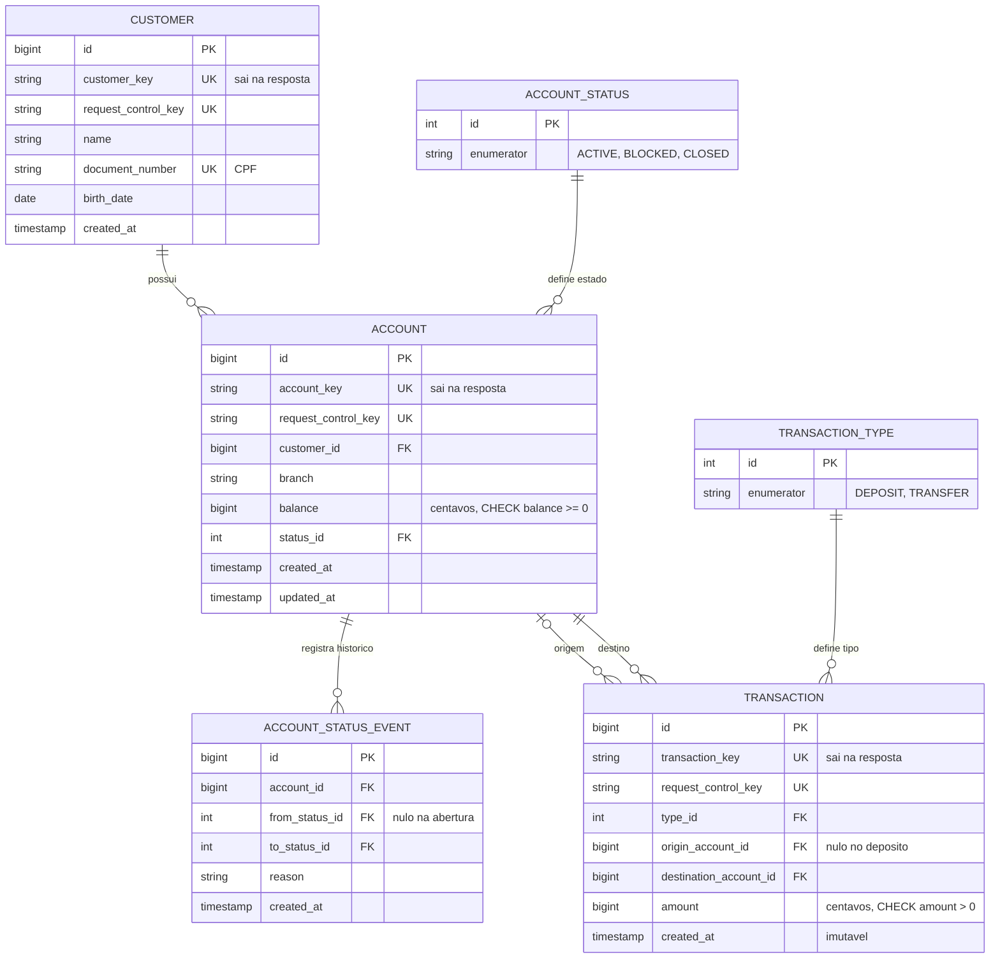
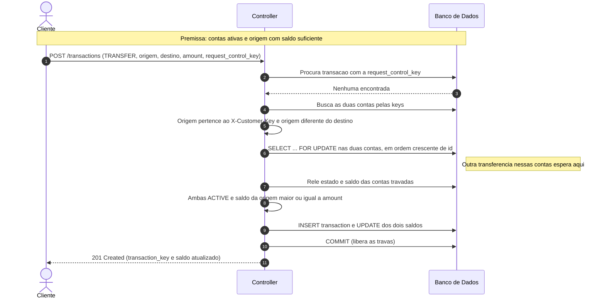
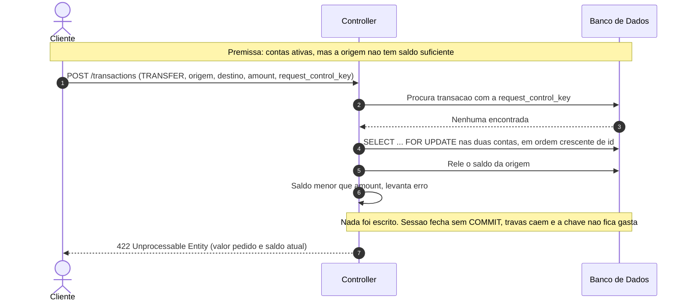
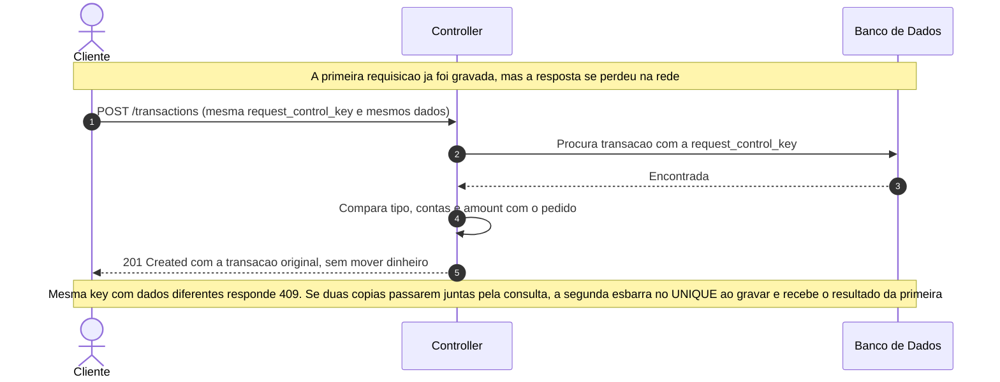
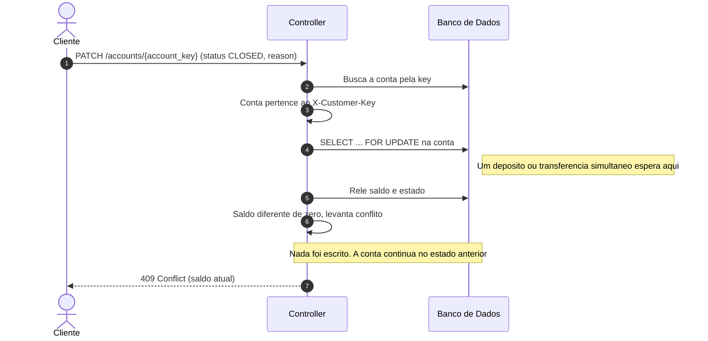

# RFC — ReP+, a solução para sua república! (Fase 1: o banco)

| | |
|---|---|
| **Time** | Leonardo Bonfá Schroeder · Guilherme Vicente Ramalho |
| **Data** | 08/10/2026 |
| **Versão** | 1 |

## Contextualização

### Entendendo o problema

O ReP+ nasce para resolver o dinheiro de repúblicas estudantis, que não têm CNPJ e por isso não conseguem abrir uma conta da casa. Antes de construir qualquer coisa específica de república, o sistema precisa ser um banco digital simples que não erra: esta fase entrega exatamente isso. O cliente se cadastra, abre uma conta, recebe depósitos, transfere para outras contas do sistema e consulta o extrato. A conta pode ser bloqueada e encerrada, e toda mudança de estado fica registrada. O que não pode dar errado: nenhum valor é criado, perdido ou contado duas vezes. O depósito é a única porta de entrada de dinheiro, uma requisição repetida nunca move dinheiro de novo, nenhuma falha deixa registro pela metade, o saldo nunca fica negativo e o histórico de transações reconstrói exatamente o saldo de cada conta. Ficam fora desta fase: as funcionalidades de república (casa, moradores, despesas e rateio), tarifas, pagamento de boleto, cartão, crédito, investimentos e autenticação de usuário, que é responsabilidade da borda.

### Explicando a solução de forma macro

O sistema tem três entidades: cliente, conta e transação. Todo movimento de dinheiro é uma linha de transação, com origem, destino e valor em centavos, que nunca é alterada nem apagada. O saldo é uma coluna da conta, atualizada na mesma transação de banco que grava o movimento: ou os dois são gravados, ou nenhum. Quem garante isso sob concorrência é a trava pessimista (`SELECT ... FOR UPDATE`) nas contas envolvidas, sempre em ordem crescente de `id`, para que duas transferências cruzadas nunca fiquem esperando uma pela outra. Toda requisição que cria algo traz uma `request_control_key`, gravada com `UNIQUE` no mesmo commit, então repetir a requisição devolve o resultado original sem mover dinheiro. Mudanças de estado da conta não sobrescrevem nada: cada uma gera um evento com o estado de origem, o de destino e o motivo.

O que foi considerado e descartado:

- **Saldo calculado somando as transações, sem coluna `balance`** — descartado porque cada transferência teria que somar o histórico inteiro da conta, e o custo cresce com o tempo. Ganharia com poucas transações por conta e auditoria mais importante que velocidade. O preço da coluna é gravar saldo e transação no mesmo commit; em troca, "soma das transações = saldo" vira uma regra que os testes conferem.
- **Trava otimista (coluna de versão e nova tentativa em caso de conflito)** — descartada porque, com dinheiro disputado, o conflito é justamente o caso que precisa dar certo, e esperar a trava é mais simples que tentar de novo. Ganharia com conflitos raros e muito mais leitura que escrita.
- **Nível de isolamento `SERIALIZABLE`** — descartado porque o banco aborta as transações em conflito e a aplicação teria que repetir sozinha. Ganharia se houvesse muitas regras cruzando várias tabelas, difíceis de travar à mão.
- **Extrato paginado por número de página (`OFFSET`)** — descartado porque, com transações novas entrando o tempo todo, a página 2 muda entre uma chamada e outra e o cliente vê movimentos repetidos ou pulados. O extrato usa cursor: a resposta traz um marcador do último movimento, e a próxima página começa depois dele. Ganharia num histórico que não cresce, em que pular direto para a página 10 importa.

### Próximas fases

Depois do banco, o ReP+ ganha as funcionalidades de república sobre esta mesma base: a república com conta própria (interna, sem dono), os moradores, as despesas da casa divididas em parcelas por morador e o pagamento dessas parcelas, que será uma transação entre contas como as desta fase. Tarifas e modelo de receita entram depois disso.

## Implementação

### Rotas

Toda rota, exceto `POST /customers`, recebe o cabeçalho `X-Customer-Key`, que traz a identidade já validada pela borda. Quando o recurso pedido não existe ou não pertence a quem pede, a resposta é `404`, e não `403`, para não confirmar que ele existe. Erros saem com `title`, `description`, `translation` e `code`. Critério dos códigos: `400` formato inválido; `404` não existe ou não é seu; `409` conflito de estado ou `request_control_key` reaproveitada com outros dados; `422` regra de negócio violada (saldo insuficiente, origem igual ao destino).

| Método | Caminho | O que faz | Entrada (campos que importam) | Saídas (status e quando) |
|---|---|---|---|---|
| `POST` | `/customers` | Cria um cliente. | `request_control_key`, `name`, `document_number`, `birth_date` | `201` cliente criado com a `customer_key`; `400` schema inválido; `409` CPF já cadastrado ou key usada com outros dados; `422` CPF com dígito verificador inválido. **Idempotente:** `UNIQUE` em `customer.request_control_key`; a repetição devolve o cliente original com `201`. |
| `GET` | `/customers/{customer_key}` | Consulta o cliente. | *(só path)* | `200` cliente; `404` não existe ou não é quem pede. |
| `POST` | `/accounts` | Abre uma conta para o cliente que pede, com saldo zero. | `request_control_key` | `201` conta criada com a `account_key`; `409` key usada com outros dados. **Idempotente:** `UNIQUE` em `account.request_control_key`. |
| `GET` | `/accounts/{account_key}` | Consulta saldo e estado da conta. | *(só path)* | `200` conta; `404` não existe ou não é de quem pede. |
| `PATCH` | `/accounts/{account_key}` | Bloqueia, desbloqueia ou encerra a conta. Nada é apagado; cada mudança gera um evento. | `status` (`ACTIVE`, `BLOCKED`, `CLOSED`), `reason` | `200` estado alterado; `404` não existe ou não é de quem pede; `409` transição proibida (sair de `CLOSED`) ou encerramento com saldo diferente de zero. **Idempotente:** pedir o estado em que a conta já está devolve `200` sem gravar evento. |
| `GET` | `/accounts/{account_key}/transactions` | Extrato da conta, do mais recente para o mais antigo, página por página. | `limit`, `cursor` *(query)* | `200` lista de movimentos e o `next_cursor` (nulo na última página); `400` cursor inválido; `404` conta não existe ou não é de quem pede. |
| `POST` | `/transactions` | Faz um depósito (dinheiro entrando de fora, numa conta de quem pede) ou uma transferência entre duas contas do sistema. | `request_control_key`, `type` (`DEPOSIT`, `TRANSFER`), `origin_account_key` (só na transferência), `destination_account_key`, `amount` (centavos, > 0) | `201` movimento realizado, com `transaction_key` e saldo atualizado; `400` schema inválido; `404` conta não existe, ou a origem (ou o destino do depósito) não é de quem pede; `409` conta bloqueada/encerrada ou key usada com outros dados; `422` saldo insuficiente ou origem igual ao destino. **Idempotente:** `UNIQUE` em `transaction.request_control_key`; a mesma key com os mesmos dados devolve a transação original sem mover nada. |

### Banco de Dados (Somente diagrama)

### Fluxos

**Transferência — caminho feliz**

**Transferência — falha: saldo insuficiente**

**Transferência — falha: a mesma requisição chega duas vezes**

**Encerramento de conta — falha: conta com saldo**

> ## Principal desafio
>
> - **Qual é:** manter o saldo certo quando várias transferências mexem nas mesmas contas ao mesmo tempo, e quando a mesma requisição chega duas vezes.
> - **Por que é difícil:** a solução óbvia (ler o saldo, conferir, gravar) quebra quando duas transferências leem o mesmo saldo antes de qualquer uma gravar: as duas passam na conferência e a conta fica negativa. Travar resolve isso, mas cria outro risco: a transferência A→B trava A e espera B, enquanto B→A trava B e espera A, e as duas ficam paradas para sempre (deadlock). E a requisição repetida por queda de rede é o mesmo problema visto de outro ângulo: duas cópias da mesma operação disputando as mesmas linhas.
> - **Como o desenho resolve:** trava pessimista nas contas, sempre em ordem crescente de `id`, então toda operação disputa as linhas na mesma sequência e o ciclo do deadlock não se forma. Depois da trava, tudo é relido; nada é escrito antes da última conferência; e cada operação termina num único commit. A `request_control_key` com `UNIQUE` impede que uma repetição, mesmo simultânea, mova dinheiro duas vezes. `CHECK balance >= 0` é a última barreira, caso o código erre. Os testes disparam transferências em paralelo, só por HTTP, e conferem que o saldo nunca fica negativo e que a soma das transações de cada conta bate com o saldo dela.
