# RFC — ReP+, a solução para sua república!

| | |
|---|---|
| **Time** | Leonardo Bonfá Schroeder · Guilherme Vicente Ramalho |
| **Data** | 08/10/2026 |
| **Versão** | 2 |

O ReP+ é construído em duas fases sobre a mesma base. A **Fase 1** é um banco digital simples que não erra. A **Fase 2** usa esse banco para resolver o dinheiro da república.

## Contextualização

### Entendendo o problema

**Fase 1 — o banco.** Repúblicas estudantis não têm CNPJ e por isso não conseguem abrir uma conta da casa. Antes de qualquer coisa específica de república, o sistema precisa ser um banco digital que não erra. O cliente se cadastra, abre uma conta, recebe depósitos, transfere para outras contas do sistema e consulta o extrato. A conta pode ser bloqueada e encerrada, e toda mudança de estado fica registrada. O que não pode dar errado: nenhum valor é criado, perdido ou contado duas vezes. O depósito é a única porta de entrada de dinheiro, uma requisição repetida nunca move dinheiro de novo, nenhuma falha deixa registro pela metade, o saldo nunca fica negativo e o histórico de transações reconstrói exatamente o saldo de cada conta.

**Fase 2 — a república.** Hoje um morador paga o aluguel, a luz e a internet e depois cobra os outros um a um, com o controle numa planilha ou no grupo de mensagens. O ReP+ dá à casa uma conta própria, administrada por um morador com papel de admin: ele cria a república, cadastra e remove moradores e cadastra as contas da casa. Contas fixas (como o aluguel, sempre o mesmo valor) viram cobranças automaticamente todo mês; nas contas variáveis (como a luz), o admin só informa o valor do mês. Cada cobrança é dividida em parcelas, uma por morador, e cada morador paga a sua parcela da própria conta para a conta da casa. Uma parcela está paga ou devida; atraso não gera juros. O que não pode dar errado: nenhuma cobrança é gerada duas vezes no mesmo mês, nenhuma parcela é paga duas vezes, toda parcela vai para quem era morador quando a cobrança nasceu e ninguém sai da república devendo.

**Fora do escopo:** tarifas, pagamento de boleto (o dinheiro sair do sistema para pagar o proprietário ou a companhia de luz), divisão proporcional aos dias ou com pesos diferentes por morador, pagamento parcial de parcela, juros ou multa por atraso, troca de admin, cartão, crédito, investimentos e autenticação de usuário, que é responsabilidade da borda.

### Explicando a solução de forma macro

**Fase 1.** O banco tem três entidades: cliente, conta e transação. Todo movimento de dinheiro é uma linha de transação, com origem, destino e valor em centavos, que nunca é alterada nem apagada. O saldo é uma coluna da conta, atualizada na mesma transação de banco que grava o movimento: ou os dois são gravados, ou nenhum. Quem garante isso sob concorrência é a trava pessimista (`SELECT ... FOR UPDATE`) nas contas envolvidas, sempre em ordem crescente de `id`, para que duas transferências cruzadas nunca fiquem esperando uma pela outra. Toda requisição que cria algo traz uma `request_control_key`, gravada com `UNIQUE` no mesmo commit, então repetir a requisição devolve o resultado original sem mover dinheiro. Mudanças de estado não sobrescrevem nada: cada uma gera um evento com o novo estado, inclusive a criação. O estado anterior de qualquer evento é o do evento que veio antes dele.

**Fase 2.** A república é dona de uma conta interna do banco da Fase 1, sem cliente titular; só o admin movimenta essa conta, e qualquer morador consulta o saldo e o extrato dela. Ser morador não é uma entidade: é um fato no tempo, registrado como evento (`JOINED` quando o admin adiciona, `LEFT` quando remove). Os moradores atuais são os clientes cujo último evento naquela república é `JOINED`. Cada conta da casa (`bill`) é um cadastro que vale para todos os meses. A cobrança de um mês (`charge`) nasce de uma conta, uma vez só por mês, garantido por `UNIQUE(bill_id, reference_month)`: as fixas são geradas por um processo automático que roda todo dia, e as variáveis quando o admin informa o valor. Cada cobrança vira uma parcela (`split`) por morador atual, em divisão igual. Pagar a parcela é uma transferência da Fase 1, da conta do morador para a conta da casa, gravada junto com o registro do pagamento num único commit. As operações que leem ou mudam a lista de moradores (entrada, saída e geração de cobrança) travam primeiro a linha da república, então nunca enxergam uma lista pela metade.

O que foi considerado e descartado:

- **Saldo calculado somando as transações, sem coluna `balance`** — descartado porque cada transferência teria que somar o histórico inteiro da conta, e o custo cresce com o tempo. Ganharia com poucas transações por conta e auditoria mais importante que velocidade. O preço da coluna é gravar saldo e transação no mesmo commit; em troca, "soma das transações = saldo" vira uma regra que os testes conferem.
- **Trava otimista (coluna de versão e nova tentativa em caso de conflito)** — descartada porque, com dinheiro disputado, o conflito é justamente o caso que precisa dar certo, e esperar a trava é mais simples que tentar de novo. Ganharia com conflitos raros e muito mais leitura que escrita.
- **Nível de isolamento `SERIALIZABLE`** — descartado porque o banco aborta as transações em conflito e a aplicação teria que repetir sozinha. Ganharia se houvesse muitas regras cruzando várias tabelas, difíceis de travar à mão.
- **Crédito e juros (empréstimo, cheque especial, saldo negativo com cobrança de juros)** — descartado porque são sistemas complexos por si só: análise de quanto emprestar a cada cliente, cálculo de juros ao longo do tempo, parcelas, atraso e inadimplência. O sistema passaria a girar em torno de algo que não é a nossa prioridade, e isso tomaria uma proporção muito maior do que o banco que queremos fazer bem feito. Também quebraria uma garantia central, a de que o saldo nunca fica negativo. Ganharia se o produto fosse um banco de crédito, e não um banco para movimentar e organizar o dinheiro que o cliente já tem.
- **Extrato paginado por número de página (`OFFSET`)** — descartado porque, com transações novas entrando o tempo todo, a página 2 muda entre uma chamada e outra e o cliente vê movimentos repetidos ou pulados. O extrato usa cursor: a resposta traz um marcador do último movimento, e a próxima página começa depois dele. Ganharia num histórico que não cresce, em que pular direto para a página 10 importa.
- **Morador como tabela própria, com status ativo ou inativo** — descartado porque morar é um fato no tempo: a pessoa entra, sai e pode voltar. Uma tabela com status sobrescreveria o passado ou exigiria uma tabela de eventos ao lado; os eventos sozinhos já guardam tudo, sem duplicar. O preço é que "quem mora aqui agora" vira uma consulta pelo último evento de cada cliente, e não uma coluna. Ganharia se o morador tivesse muitos dados próprios, como quarto ou peso no rateio.
- **Juros ou multa por atraso** — descartado porque exigiria calcular valores ao longo do tempo e discutir regras de cobrança que não são a dor que resolvemos. A parcela tem dois estados: paga ou devida. Quem está atrasado é calculado na hora (parcela devida com vencimento no passado), sem gravar nada. Ganharia se a casa precisasse de um incentivo financeiro para os moradores pagarem em dia.
- **Pagamento parcial de parcela** — descartado porque cada parcela passaria a ter um valor já pago, um estado intermediário e vários pagamentos, e cada pagamento teria que somar os anteriores com trava. Com um pagamento por parcela, a própria restrição `UNIQUE(split_id)` impede pagar duas vezes. Ganharia com parcelas grandes, como o aluguel, que o morador não consegue pagar de uma vez.
- **Gerar as cobranças fixas só quando alguém consulta (geração preguiçosa)** — descartado porque, se ninguém abrir o app, a cobrança do mês não existe e o morador não vê que deve. Um processo automático diário garante que a cobrança nasce no mês certo. Ganharia por não precisar de mais um processo rodando além da API.

### Próximas fases

Divisão proporcional aos dias (quem entrou no dia 20 não paga o mês inteiro) e divisão com pesos (quarto maior paga mais), cancelamento de uma cobrança lançada com valor errado, troca de admin, pagamento de boleto para o dinheiro sair da conta da casa e, por último, tarifas e modelo de receita.

## Implementação

### Rotas

Toda rota, exceto `POST /customers`, recebe o cabeçalho `X-Customer-Key`, que traz a identidade já validada pela borda. Quando o recurso pedido não existe ou não pertence a quem pede, a resposta é `404`, e não `403`, para não confirmar que ele existe. Erros saem com `title`, `description`, `translation` e `code`. Critério dos códigos: `400` formato inválido; `404` não existe ou não é seu; `409` conflito de estado ou `request_control_key` reaproveitada com outros dados; `422` regra de negócio violada (saldo insuficiente, origem igual ao destino).

**Quem pode o quê na Fase 2.** "Admin" é o cliente que criou a república. "Morador" é um cliente cujo último evento naquela república é `JOINED`; o admin também é morador. A conta da casa é movimentada só pelo admin, pelas mesmas rotas da Fase 1; saldo e extrato dela podem ser consultados por qualquer morador.

#### Fase 1 — banco

| Método | Caminho | O que faz | Entrada (campos que importam) | Saídas (status e quando) |
|---|---|---|---|---|
| `POST` | `/customers` | Cria um cliente. | `request_control_key`, `name`, `document_number`, `birth_date` | `201` cliente criado com a `customer_key`; `400` schema inválido; `409` CPF já cadastrado ou key usada com outros dados; `422` CPF com dígito verificador inválido. **Idempotente:** `UNIQUE` em `customer.request_control_key`; a repetição devolve o cliente original com `201`. |
| `GET` | `/customers/{customer_key}` | Consulta o cliente. | *(só path)* | `200` cliente; `404` não existe ou não é quem pede. |
| `POST` | `/accounts` | Abre uma conta pessoal para o cliente que pede, com saldo zero. | `request_control_key` | `201` conta criada com a `account_key`; `409` key usada com outros dados. **Idempotente:** `UNIQUE` em `account.request_control_key`. |
| `GET` | `/accounts/{account_key}` | Consulta saldo e estado da conta. | *(só path)* | `200` conta; `404` não existe, ou não é de quem pede (na conta da casa: quem pede não é morador). |
| `PATCH` | `/accounts/{account_key}` | Bloqueia, desbloqueia ou encerra uma conta pessoal. Nada é apagado; cada mudança gera um evento. | `status` (`ACTIVE`, `BLOCKED`, `CLOSED`), `reason` | `200` estado alterado; `404` não existe ou não é de quem pede; `409` transição proibida (sair de `CLOSED`), encerramento com saldo diferente de zero, ou conta da casa. **Idempotente:** pedir o estado em que a conta já está devolve `200` sem gravar evento. |
| `GET` | `/accounts/{account_key}/transactions` | Extrato da conta, do mais recente para o mais antigo, página por página. | `limit`, `cursor` *(query)* | `200` lista de movimentos e o `next_cursor` (nulo na última página); `400` cursor inválido; `404` conta não existe ou não é de quem pede. |
| `POST` | `/transactions` | Faz um depósito (dinheiro entrando de fora, numa conta de quem pede) ou uma transferência entre duas contas do sistema. | `request_control_key`, `type` (`DEPOSIT`, `TRANSFER`), `origin_account_key` (só na transferência), `destination_account_key`, `amount` (centavos, > 0) | `201` movimento realizado, com `transaction_key` e saldo atualizado; `400` schema inválido; `404` conta não existe, ou a origem (ou o destino do depósito) não é de quem pede (na conta da casa: quem pede não é o admin); `409` conta bloqueada/encerrada ou key usada com outros dados; `422` saldo insuficiente ou origem igual ao destino. **Idempotente:** `UNIQUE` em `transaction.request_control_key`; a mesma key com os mesmos dados devolve a transação original sem mover nada. |

#### Fase 2 — república

| Método | Caminho | O que faz | Entrada (campos que importam) | Saídas (status e quando) |
|---|---|---|---|---|
| `POST` | `/republicas` | Cria a república, a conta da casa e o evento `JOINED` de quem pede, que vira o admin. Tudo no mesmo commit. | `request_control_key`, `name` | `201` com `republica_key` e `account_key` da casa; `400` schema inválido; `409` quem pede já mora em outra república, ou key usada com outros dados. **Idempotente:** `UNIQUE` em `republica.request_control_key`. |
| `GET` | `/republicas/{republica_key}` | Consulta a república: nome, admin, moradores atuais e `account_key` da casa. | *(só path)* | `200` república; `404` não existe ou quem pede não é morador. |
| `POST` | `/republicas/{republica_key}/member_events` | Só o admin. Adiciona (`JOINED`) ou remove (`LEFT`) um morador. Nada é apagado: cada entrada e saída é um evento novo. | `request_control_key`, `customer_key`, `type` (`JOINED`, `LEFT`) | `201` evento registrado; `400` schema inválido; `404` república não existe ou quem pede não é o admin, ou cliente não existe; `409` no `JOINED`: o cliente já mora nesta ou em outra república; no `LEFT`: o cliente não mora aqui, é o próprio admin, ou tem parcelas devidas (a resposta traz o total devido e as `split_key`s); `409` key usada com outros dados. **Idempotente:** `UNIQUE` em `member_event.request_control_key`. |
| `GET` | `/republicas/{republica_key}/member_events` | Histórico de entradas e saídas, do mais recente para o mais antigo. | `limit`, `cursor` *(query)* | `200` lista e `next_cursor`; `404` não existe ou quem pede não é morador. |
| `POST` | `/republicas/{republica_key}/bills` | Só o admin. Cadastra uma conta da casa, fixa ou variável. | `request_control_key`, `title`, `type` (`FIXED`, `VARIABLE`), `amount` (centavos, obrigatório na fixa e proibido na variável), `due_day` (1 a 28) | `201` com `bill_key`; `400` schema inválido, `amount` ausente na fixa ou presente na variável, `due_day` fora de 1 a 28; `404` república não existe ou quem pede não é o admin; `409` key usada com outros dados. **Idempotente:** `UNIQUE` em `bill.request_control_key`. |
| `GET` | `/republicas/{republica_key}/bills` | Lista as contas da casa. Cada uma traz `charged_this_month`; o aplicativo usa esse campo para abrir o pop-up das variáveis que ainda não têm valor no mês. | `status` *(query, opcional)* | `200` lista; `404` não existe ou quem pede não é morador. |
| `PATCH` | `/bills/{bill_key}` | Só o admin. Desativa uma conta que deixou de existir (internet cancelada, por exemplo). Cobranças já geradas continuam valendo. | `status` (`INACTIVE`) | `200` desativada; `404` não existe ou quem pede não é o admin. **Idempotente:** pedir `INACTIVE` de uma conta já inativa devolve `200` sem gravar evento. |
| `POST` | `/bills/{bill_key}/charges` | Só o admin, só em conta variável. Informa o valor do mês: cria a cobrança e uma parcela por morador atual, no mesmo commit. | `request_control_key`, `reference_month` (`AAAA-MM`), `amount` (centavos, > 0) | `201` com `charge_key` e as parcelas; `400` schema inválido; `404` conta não existe ou quem pede não é o admin; `409` já existe cobrança desta conta neste mês, conta inativa, ou key usada com outros dados; `422` conta fixa (essas são geradas automaticamente). **Idempotente:** `UNIQUE(bill_id, reference_month)` e `UNIQUE` em `charge.request_control_key`. |
| `GET` | `/republicas/{republica_key}/splits` | Parcelas da república. O admin vê todas; o morador vê só as dele. | `status` (`PENDING`, `PAID`), `customer_key` (só admin), `limit`, `cursor` *(query)* | `200` lista, com `overdue` calculado (devida e vencida) e `next_cursor`; `404` não existe ou quem pede não é morador. |
| `POST` | `/splits/{split_key}/payments` | O morador paga a sua parcela: transfere o valor da conta dele para a conta da casa e marca a parcela como paga, no mesmo commit. | `request_control_key`, `origin_account_key` | `201` com `payment_key`, `transaction_key` e saldo atualizado; `404` parcela não existe ou não é de quem pede, ou conta de origem não é de quem pede; `409` parcela já paga, conta bloqueada/encerrada, ou key usada com outros dados; `422` saldo insuficiente. **Idempotente:** `UNIQUE` em `payment.request_control_key` devolve o pagamento original; `UNIQUE(split_id)` impede um segundo pagamento da mesma parcela. |

**Processo automático (não é rota):** o gerador de contas fixas roda todo dia como um serviço do `docker-compose`, com a mesma imagem da API. Para cada conta fixa ativa, cria a cobrança do mês atual e as parcelas, se ainda não existirem. Rodar duas vezes no mesmo dia não duplica nada, por causa de `UNIQUE(bill_id, reference_month)`.

**Divisão da parcela:** o valor é dividido igualmente entre os moradores atuais no momento em que a cobrança nasce. Os centavos que sobram vão, um a um, para os primeiros moradores em ordem crescente de `customer_id`. Exemplo: R$ 100,00 entre 3 moradores dá R$ 33,34, R$ 33,33 e R$ 33,33. A soma das parcelas é sempre igual ao valor da cobrança. O vencimento é o `due_day` do mês de referência.

### Banco de Dados (Somente diagrama)

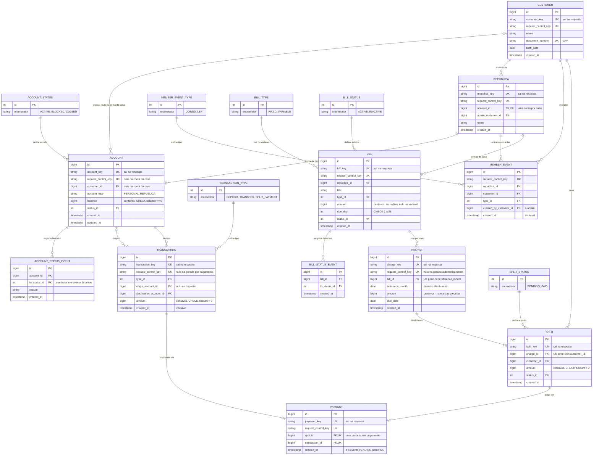

### Fluxos

**Ordem global de travas**, seguida por toda operação que trava mais de uma linha: **república → cliente → contas (por `id` crescente) → parcela**. Toda operação disputa as linhas na mesma sequência, então duas operações nunca ficam esperando uma pela outra.

#### Fase 1 — banco

**Transferência — caminho feliz**

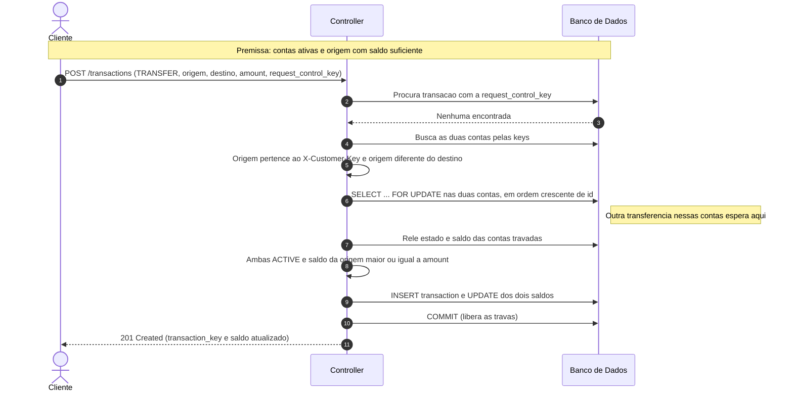

**Transferência — falha: saldo insuficiente**

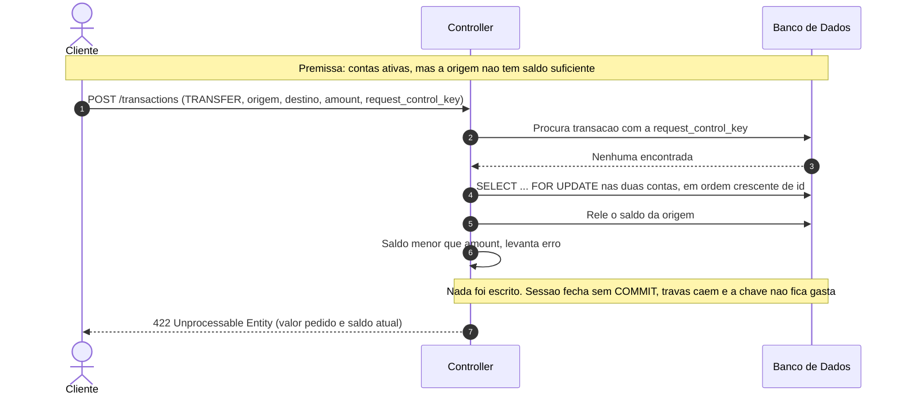

**Transferência — falha: a mesma requisição chega duas vezes**

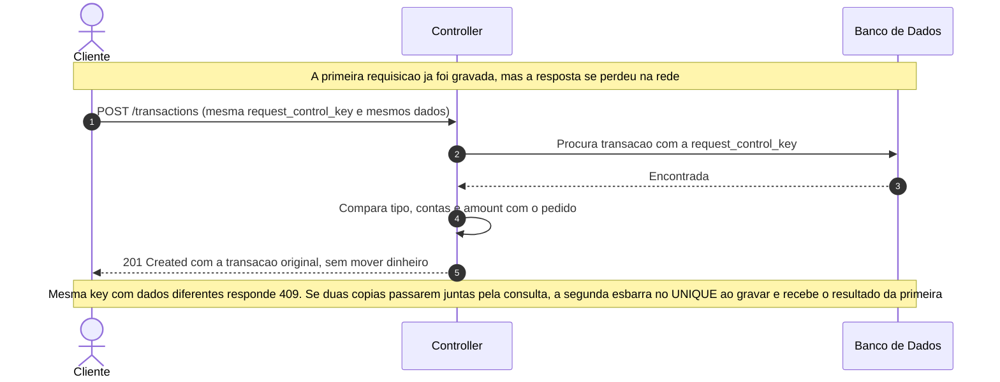

**Encerramento de conta — falha: conta com saldo**

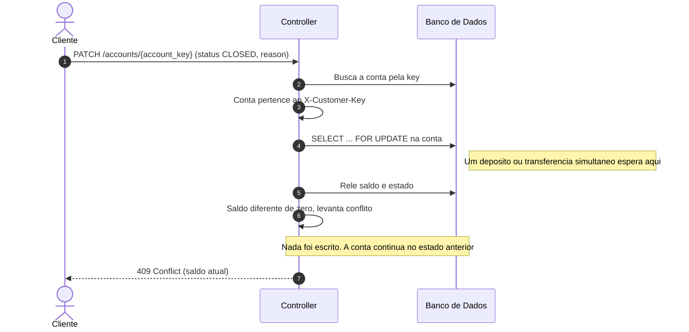

#### Fase 2 — república

**Geração automática das contas fixas — caminho feliz (e rodando duas vezes)**

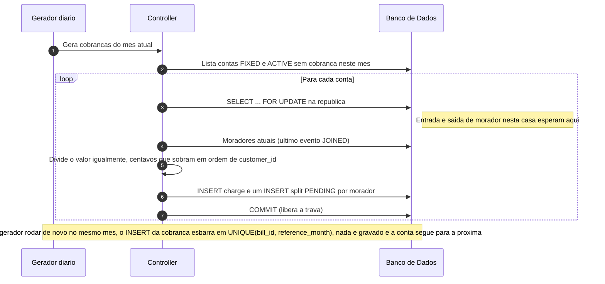

**Lançamento de conta variável — caminho feliz**

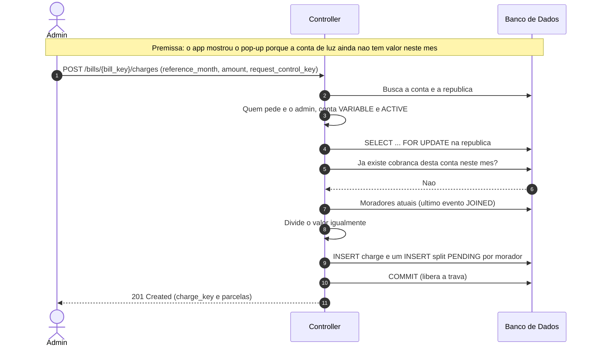

**Pagamento de parcela — caminho feliz**

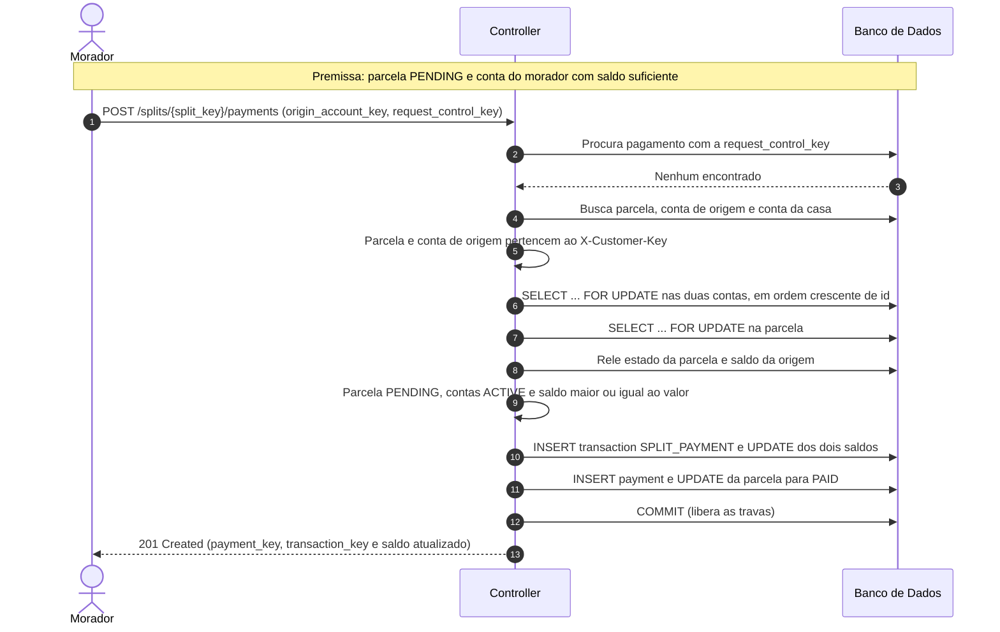

**Pagamento de parcela — falha: dois pagamentos da mesma parcela ao mesmo tempo**

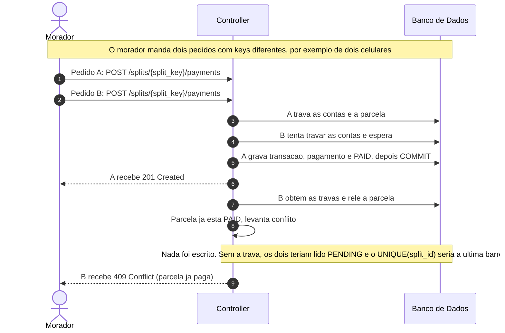

**Saída de morador — falha: dívida pendente**

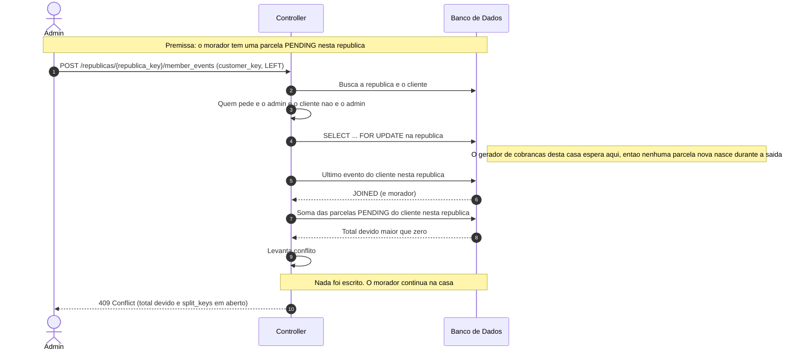

**Entrada de morador — falha: o cliente já mora em outra república**

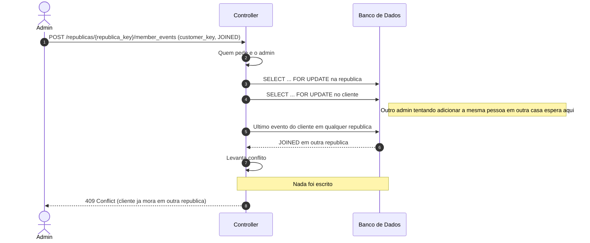

> ## Principal desafio — Fase 1
>
> - **Qual é:** manter o saldo certo quando várias transferências mexem nas mesmas contas ao mesmo tempo, e quando a mesma requisição chega duas vezes.
> - **Por que é difícil:** a solução óbvia (ler o saldo, conferir, gravar) quebra quando duas transferências leem o mesmo saldo antes de qualquer uma gravar: as duas passam na conferência e a conta fica negativa. Travar resolve isso, mas cria outro risco: a transferência A→B trava A e espera B, enquanto B→A trava B e espera A, e as duas ficam paradas para sempre (deadlock). E a requisição repetida por queda de rede é o mesmo problema visto de outro ângulo: duas cópias da mesma operação disputando as mesmas linhas.
> - **Como o desenho resolve:** trava pessimista nas contas, sempre em ordem crescente de `id`, então toda operação disputa as linhas na mesma sequência e o ciclo do deadlock não se forma. Depois da trava, tudo é relido; nada é escrito antes da última conferência; e cada operação termina num único commit. A `request_control_key` com `UNIQUE` impede que uma repetição, mesmo simultânea, mova dinheiro duas vezes. `CHECK balance >= 0` é a última barreira, caso o código erre. Os testes disparam transferências em paralelo, só por HTTP, e conferem que o saldo nunca fica negativo e que a soma das transações de cada conta bate com o saldo dela.

> ## Principal desafio — Fase 2
>
> - **Qual é:** garantir que cada cobrança vire as parcelas certas, para os moradores certos, uma vez só, com moradores entrando e saindo, o gerador automático rodando e pagamentos acontecendo ao mesmo tempo.
> - **Por que é difícil:** a lista de moradores não é uma coluna, é o resultado de uma consulta sobre eventos, e ela pode mudar no meio de uma operação. Se o gerador lê a lista enquanto o admin remove alguém, o morador pode sair e logo depois receber uma parcela de uma casa onde não mora mais. Se o gerador roda duas vezes (reinício, falha de rede), a casa recebe o aluguel em dobro. E dois pagamentos da mesma parcela, lidos ao mesmo tempo, quitariam a parcela duas vezes.
> - **Como o desenho resolve:** toda operação que lê ou muda a lista de moradores trava primeiro a linha da república, então entrada, saída e geração de cobrança da mesma casa acontecem uma de cada vez. A entrada também trava a linha do cliente, para a mesma pessoa não entrar em duas casas ao mesmo tempo. `UNIQUE(bill_id, reference_month)` faz o gerador poder rodar quantas vezes for preciso sem duplicar cobrança, e `UNIQUE(charge_id, customer_id)` impede duas parcelas da mesma pessoa na mesma cobrança. O pagamento trava as contas e a parcela, relê o estado e, se a parcela já estiver paga, responde `409`; `UNIQUE(split_id)` em `payment` é a última barreira. Todas as travas seguem a mesma ordem global (república → cliente → contas → parcela), então nenhuma operação fica esperando outra para sempre.
