# RFC — ReP+, a solução para sua república!

| | |
|---|---|
| **Time** | Leonardo Bonfá Schroeder · Guilherme Vicente Ramalho |
| **Data** | 09/10/2026 |
| **Versão** | 3 |

O ReP+ é construído em duas fases sobre a mesma base. A **Fase 1** é um banco digital simples que não erra. A **Fase 2** usa esse banco para resolver o dinheiro da república.

## Contextualização

### Entendendo o problema

**Fase 1 — o banco.** Repúblicas estudantis não têm CNPJ e por isso não conseguem abrir uma conta da casa. Antes de qualquer coisa específica de república, o sistema precisa ser um banco digital que não erra. O cliente se cadastra, abre uma conta, recebe depósitos, transfere para outras contas do sistema, paga boletos e consulta o extrato. A conta pode ser bloqueada e encerrada, e toda mudança de estado fica registrada. O que não pode dar errado: nenhum valor é criado, perdido ou contado duas vezes. O depósito é a única porta de entrada de dinheiro e o boleto a única de saída, uma requisição repetida nunca move dinheiro de novo, nenhuma falha deixa registro pela metade, o saldo nunca fica negativo e o histórico de transações reconstrói exatamente o saldo de cada conta.

**Fase 2 — a república.** Hoje um morador paga o aluguel, a luz e a internet e depois cobra os outros um a um, com o controle numa planilha ou no grupo de mensagens. O ReP+ dá à casa uma conta própria, administrada por um morador com papel de admin: ele cria a república, cadastra e remove moradores, define quanto por cento das contas cada morador paga, cadastra as contas da casa e, quando quiser sair ou deixar a função, passa o papel de admin para outro morador. Contas fixas (como o aluguel, sempre o mesmo valor) viram cobranças automaticamente todo mês; nas contas variáveis (como a luz), o admin só informa o valor do mês. Cada cobrança é dividida em parcelas, uma por morador, conforme os percentuais, e cada morador paga a sua parcela da própria conta para a conta da casa. Com o dinheiro reunido, o admin paga os boletos da casa direto da conta dela. Uma cobrança lançada errada pode ser cancelada pelo admin enquanto ninguém pagou. Uma parcela está paga ou devida; atraso não gera juros. O que não pode dar errado: nenhuma cobrança é gerada duas vezes no mesmo mês, nenhuma parcela é paga duas vezes, a soma das parcelas é sempre o valor da cobrança, toda parcela vai para quem era morador quando a cobrança nasceu, ninguém sai da república devendo, a casa nunca fica sem admin e nenhum dinheiro sai da conta da casa sem rastro.

**Fora do escopo:** tarifas, divisão proporcional aos dias (quem entrou no dia 20), despesas que só alguns moradores dividem, pagamento parcial de parcela, juros ou multa por atraso, cancelar uma cobrança que já recebeu pagamento (devolver dinheiro aos moradores), admin que some sem nomear sucessor, cartão, crédito, investimentos e autenticação de usuário, que é responsabilidade da borda.

### Explicando a solução de forma macro

**Fase 1.** O banco tem três entidades: cliente, conta e transação. Todo movimento de dinheiro é uma linha de transação, com origem, destino e valor em centavos, que nunca é alterada nem apagada. O saldo é uma coluna da conta, atualizada na mesma transação de banco que grava o movimento: ou os dois são gravados, ou nenhum. Quem garante isso sob concorrência é a trava pessimista (`SELECT ... FOR UPDATE`) nas contas envolvidas, sempre em ordem crescente de `id`, para que duas transferências cruzadas nunca fiquem esperando uma pela outra. Toda requisição que cria algo traz uma `request_control_key`, gravada com `UNIQUE` no mesmo commit, então repetir a requisição devolve o resultado original sem mover dinheiro. Mudanças de estado não sobrescrevem nada: cada uma gera um evento com o novo estado, inclusive a criação. O estado anterior de qualquer evento é o do evento que veio antes dele.

O pagamento de boleto é o único movimento que depende de um serviço de fora (a API de boletos, chamada pelo `connector` que o repositório-base já traz). Por isso ele acontece em duas etapas, e nenhuma trava fica presa durante a chamada externa. Primeiro, com a conta travada, o valor é debitado e a transação nasce como `PROCESSING`, num commit curto. Depois, já sem trava, o serviço é chamado. Se ele confirma, a transação vira `COMPLETED`; se recusa, vira `FAILED` e o dinheiro volta numa transação de estorno; se não responde, ela continua `PROCESSING` e um processo automático pergunta de novo ao serviço até ter uma resposta definitiva, sempre com a mesma chave, para o boleto nunca ser pago duas vezes.

**Fase 2.** A república é dona de uma conta interna do banco da Fase 1, sem cliente titular; só o admin movimenta essa conta, e qualquer morador consulta o saldo e o extrato dela. Ser morador não é uma entidade: é um fato no tempo, registrado como evento (`JOINED` quando o admin adiciona, `LEFT` quando remove). Os moradores atuais são os clientes cujo último evento naquela república é `JOINED`. Ser admin segue a mesma ideia: a república guarda quem é o admin atual, e cada troca é um evento.

Quanto cada morador paga é um **plano de divisão**: uma lista com o percentual de cada morador atual, que soma exatamente 100%. O plano nunca é editado; definir novos percentuais cria um plano novo, e vale sempre o mais recente. Quando alguém entra ou sai, o sistema cria no mesmo commit um plano com divisão igual entre os novos moradores, e o admin ajusta se quiser. Assim, nunca existe um plano que deixe alguém de fora ou cobre de quem já saiu.

Cada conta da casa (`bill`) é um cadastro que vale para todos os meses. A cobrança de um mês (`charge`) nasce de uma conta, uma vez só por mês: as fixas são geradas por um processo automático que roda todo dia, e as variáveis quando o admin informa o valor. Cada cobrança vira uma parcela (`split`) por morador atual, calculada pelo plano vigente, e guarda qual plano usou. Pagar a parcela é uma transferência da Fase 1, da conta do morador para a conta da casa, gravada no mesmo commit que o evento `PAID` da parcela, que aponta para essa transação. Pagamento não é uma entidade: é o evento que leva a parcela de devida para paga. Cancelar uma cobrança leva a cobrança e todas as parcelas para `CANCELED`, com eventos, e só é possível enquanto nenhuma parcela foi paga.

As operações que leem ou mudam a lista de moradores, o admin ou o plano (entrada, saída, troca de admin, novo plano, geração e cancelamento de cobrança) travam primeiro a linha da república, então nunca enxergam a casa pela metade.

O que foi considerado e descartado:

- **Saldo calculado somando as transações, sem coluna `balance`** — descartado porque cada transferência teria que somar o histórico inteiro da conta, e o custo cresce com o tempo. Ganharia com poucas transações por conta e auditoria mais importante que velocidade. O preço da coluna é gravar saldo e transação no mesmo commit; em troca, "soma das transações = saldo" vira uma regra que os testes conferem.
- **Trava otimista (coluna de versão e nova tentativa em caso de conflito)** — descartada porque, com dinheiro disputado, o conflito é justamente o caso que precisa dar certo, e esperar a trava é mais simples que tentar de novo. Ganharia com conflitos raros e muito mais leitura que escrita.
- **Nível de isolamento `SERIALIZABLE`** — descartado porque o banco aborta as transações em conflito e a aplicação teria que repetir sozinha. Ganharia se houvesse muitas regras cruzando várias tabelas, difíceis de travar à mão.
- **Crédito e juros (empréstimo, cheque especial, saldo negativo com cobrança de juros)** — descartado porque são sistemas complexos por si só: análise de quanto emprestar a cada cliente, cálculo de juros ao longo do tempo, parcelas, atraso e inadimplência. O sistema passaria a girar em torno de algo que não é a nossa prioridade, e isso tomaria uma proporção muito maior do que o banco que queremos fazer bem feito. Também quebraria uma garantia central, a de que o saldo nunca fica negativo. Ganharia se o produto fosse um banco de crédito, e não um banco para movimentar e organizar o dinheiro que o cliente já tem.
- **Extrato paginado por número de página (`OFFSET`)** — descartado porque, com transações novas entrando o tempo todo, a página 2 muda entre uma chamada e outra e o cliente vê movimentos repetidos ou pulados. O extrato usa cursor: a resposta traz um marcador do último movimento, e a próxima página começa depois dele. Ganharia num histórico que não cresce, em que pular direto para a página 10 importa.
- **Pagar o boleto numa etapa só, com a conta travada durante a chamada ao serviço de fora** — descartado porque a trava duraria o tempo da chamada (até o limite de espera), e todo depósito, transferência ou pagamento daquela conta ficaria parado. E, se o serviço não respondesse, não daria para saber se o boleto foi pago. Ganharia se o serviço fosse interno, rápido e sempre disponível.
- **Morador como tabela própria, com status ativo ou inativo** — descartado porque morar é um fato no tempo: a pessoa entra, sai e pode voltar. Uma tabela com status sobrescreveria o passado ou exigiria uma tabela de eventos ao lado; os eventos sozinhos já guardam tudo, sem duplicar. O preço é que "quem mora aqui agora" vira uma consulta pelo último evento de cada cliente, e não uma coluna. Ganharia se o morador tivesse muitos dados próprios.
- **Percentual por conta da casa, em vez de um plano por república** — descartado porque o admin teria que configurar a divisão de cada conta, e toda entrada ou saída de morador exigiria refazer todas elas. Um plano por casa cobre o caso comum (quarto maior paga mais em tudo). Ganharia com despesas que só alguns moradores dividem, como a cerveja da festa.
- **Manter o plano antigo quando alguém entra ou sai, redistribuindo os percentuais automaticamente** — descartado porque o sistema estaria inventando uma decisão que é da casa (quem absorve a parte de quem saiu?). Voltar para divisão igual é previsível, e o admin ajusta. Ganharia se as casas raramente mudassem os percentuais depois de definidos.
- **Sucessor automático quando o admin sai (por exemplo, o morador mais antigo)** — descartado porque quem administra o dinheiro da casa é uma decisão das pessoas, não do sistema. O admin só pode sair depois de passar o papel. Ganharia se fosse comum o admin desaparecer sem avisar.
- **Cancelar cobrança que já recebeu pagamento, devolvendo o dinheiro** — descartado porque exigiria uma transferência de volta para cada morador que pagou e a regra de o que fazer se a casa já gastou o dinheiro. Com o bloqueio, o admin corrige antes de alguém pagar. Ganharia se lançamentos errados fossem comuns e descobertos tarde.
- **Juros ou multa por atraso** — descartado porque exigiria calcular valores ao longo do tempo e discutir regras de cobrança que não são a dor que resolvemos. A parcela está paga ou devida. Quem está atrasado é calculado na hora (parcela devida com vencimento no passado), sem gravar nada. Ganharia se a casa precisasse de um incentivo financeiro para os moradores pagarem em dia.
- **Pagamento parcial de parcela** — descartado porque cada parcela passaria a ter um valor já pago, um estado intermediário e vários pagamentos, e cada pagamento teria que somar os anteriores com trava. Com um pagamento por parcela, um índice único que aceita no máximo um evento `PAID` por parcela impede pagar duas vezes. Ganharia com parcelas grandes, como o aluguel, que o morador não consegue pagar de uma vez.
- **Tabela própria de pagamento (`payment`)** — descartada porque, sem pagamento parcial, cada parcela tem no máximo um pagamento, e o que essa tabela guardaria (quando a parcela foi paga e por qual transação) é exatamente o evento `PAID` da parcela. Tratar o pagamento como evento mantém o mesmo padrão da conta bancária e da conta recorrente da casa (`bill`): o estado atual na entidade e o histórico em eventos. Ganharia se o pagamento parcial voltasse, porque aí uma parcela teria vários pagamentos.
- **Gerar as cobranças fixas só quando alguém consulta (geração preguiçosa)** — descartado porque, se ninguém abrir o app, a cobrança do mês não existe e o morador não vê que deve. Um processo automático diário garante que a cobrança nasce no mês certo. Ganharia por não precisar de mais um processo rodando além da API.

### Próximas fases

Divisão proporcional aos dias (quem entrou no dia 20 não paga o mês inteiro), despesas que só alguns moradores dividem, devolução de dinheiro ao cancelar uma cobrança já paga e, por último, tarifas e modelo de receita.

## Implementação

### Rotas

**Nome das rotas:** o recurso fica no singular quando a rota cria ou trata um item só (`POST /account`, `GET /account/{account_key}`) e no plural só quando devolve uma lista (`GET /account/{account_key}/transactions`), como no repositório-base (`/sample_entity` e `/sample_entities`).

Toda rota, exceto `POST /customer`, recebe o cabeçalho `X-Customer-Key`, que traz a identidade já validada pela borda. Quando o recurso pedido não existe ou não pertence a quem pede, a resposta é `404`, e não `403`, para não confirmar que ele existe. Erros saem com `title`, `description`, `translation` e `code`. Critério dos códigos: `400` formato inválido; `404` não existe ou não é seu; `409` conflito de estado ou `request_control_key` reaproveitada com outros dados; `422` regra de negócio violada (saldo insuficiente, origem igual ao destino, percentuais que não somam 100%); `502` o serviço de fora falhou antes de qualquer dinheiro se mover.

**Quem pode o quê na Fase 2.** "Admin" é o admin atual da república: quem a criou ou quem recebeu o papel numa troca. "Morador" é um cliente cujo último evento naquela república é `JOINED`; o admin também é morador. A conta da casa é movimentada só pelo admin, pelas mesmas rotas da Fase 1; saldo e extrato dela podem ser consultados por qualquer morador.

#### Fase 1 — banco

| Método | Caminho | O que faz | Entrada (campos que importam) | Saídas (status e quando) |
|---|---|---|---|---|
| `POST` | `/customer` | Cria um cliente. | `request_control_key`, `name`, `document_number`, `birth_date` | `201` cliente criado com a `customer_key`; `400` schema inválido; `409` CPF já cadastrado ou key usada com outros dados; `422` CPF com dígito verificador inválido. **Idempotente:** `UNIQUE` em `customer.request_control_key`; a repetição devolve o cliente original com `201`. |
| `GET` | `/customer/{customer_key}` | Consulta o cliente. | *(só path)* | `200` cliente; `404` não existe ou não é quem pede. |
| `POST` | `/account` | Abre uma conta pessoal para o cliente que pede, com saldo zero. | `request_control_key` | `201` conta criada com a `account_key`; `409` key usada com outros dados. **Idempotente:** `UNIQUE` em `account.request_control_key`. |
| `GET` | `/account/{account_key}` | Consulta saldo e estado da conta. | *(só path)* | `200` conta; `404` não existe, ou não é de quem pede (na conta da casa: quem pede não é morador). |
| `PATCH` | `/account/{account_key}` | Bloqueia, desbloqueia ou encerra uma conta pessoal. Nada é apagado; cada mudança gera um evento. | `status` (`ACTIVE`, `BLOCKED`, `CLOSED`), `reason` | `200` estado alterado; `404` não existe ou não é de quem pede; `409` transição proibida (sair de `CLOSED`), encerramento com saldo diferente de zero, ou conta da casa. **Idempotente:** pedir o estado em que a conta já está devolve `200` sem gravar evento. |
| `GET` | `/account/{account_key}/transactions` | Extrato da conta, do mais recente para o mais antigo, página por página. | `limit`, `cursor` *(query)* | `200` lista de movimentos, cada um com seu status, e o `next_cursor` (nulo na última página); `400` cursor inválido; `404` conta não existe ou não é de quem pede. |
| `POST` | `/transaction` | Faz um depósito (dinheiro entrando de fora, numa conta de quem pede), uma transferência entre duas contas do sistema ou o pagamento de um boleto (dinheiro saindo do sistema). No boleto, o valor vem da API de boletos, nunca do cliente. | `request_control_key`, `type` (`DEPOSIT`, `TRANSFER`, `BILL_PAYMENT`), `origin_account_key` (transferência e boleto), `destination_account_key` (depósito e transferência), `amount` (centavos, > 0; não vai no boleto), `bank_slip_key` (só no boleto) | `201` movimento concluído, com `transaction_key` e saldo atualizado; `202` boleto debitado e em processamento, porque a API de boletos não respondeu a tempo (o resultado sai em `GET /transaction/{transaction_key}`); `400` schema inválido; `404` conta não existe, ou a origem (ou o destino do depósito) não é de quem pede (na conta da casa: quem pede não é o admin); `409` conta bloqueada/encerrada ou key usada com outros dados; `422` saldo insuficiente, origem igual ao destino, ou boleto inexistente, vencido ou já pago; `502` a API de boletos falhou na consulta, antes de qualquer débito. **Idempotente:** `UNIQUE` em `transaction.request_control_key`; a mesma key com os mesmos dados devolve a transação original, no estado em que ela estiver, sem mover nada. |
| `GET` | `/transaction/{transaction_key}` | Consulta uma transação e o seu status. É como o cliente acompanha um boleto em processamento. | *(só path)* | `200` transação com status (`PROCESSING`, `COMPLETED`, `FAILED`); `404` não existe ou nenhuma das contas é de quem pede. |

#### Fase 2 — república

| Método | Caminho | O que faz | Entrada (campos que importam) | Saídas (status e quando) |
|---|---|---|---|---|
| `POST` | `/republica` | Cria a república, a conta da casa, o evento `JOINED` e o evento de admin de quem pede, e um plano de divisão com 100% para ele. Tudo no mesmo commit. | `request_control_key`, `name` | `201` com `republica_key` e `account_key` da casa; `400` schema inválido; `409` quem pede já mora em outra república, ou key usada com outros dados. **Idempotente:** `UNIQUE` em `republica.request_control_key`. |
| `GET` | `/republica/{republica_key}` | Consulta a república: nome, admin atual, moradores atuais e `account_key` da casa. | *(só path)* | `200` república; `404` não existe ou quem pede não é morador. |
| `POST` | `/republica/{republica_key}/member_event` | Só o admin. Adiciona (`JOINED`) ou remove (`LEFT`) um morador e, no mesmo commit, cria um plano de divisão igual entre os moradores que ficam. Nada é apagado: cada entrada e saída é um evento novo. | `request_control_key`, `customer_key`, `type` (`JOINED`, `LEFT`) | `201` evento registrado e novo plano; `400` schema inválido; `404` república não existe ou quem pede não é o admin, ou cliente não existe; `409` no `JOINED`: o cliente já mora nesta ou em outra república; no `LEFT`: o cliente não mora aqui, é o admin atual (precisa passar o papel antes), ou tem parcelas devidas (a resposta traz o total devido e as `split_key`s); `409` key usada com outros dados. **Idempotente:** `UNIQUE` em `member_event.request_control_key`. |
| `GET` | `/republica/{republica_key}/member_events` | Histórico de entradas e saídas, do mais recente para o mais antigo. | `limit`, `cursor` *(query)* | `200` lista e `next_cursor`; `404` não existe ou quem pede não é morador. |
| `POST` | `/republica/{republica_key}/admin_event` | Só o admin. Passa o papel de admin para outro morador. Depois disso, o antigo admin vira morador comum e pode ser removido pelo novo. | `request_control_key`, `customer_key` (o novo admin) | `201` troca registrada; `400` schema inválido; `404` república não existe ou quem pede não é o admin; `409` o cliente não é morador desta república, já é o admin, ou key usada com outros dados. **Idempotente:** `UNIQUE` em `admin_event.request_control_key`. |
| `POST` | `/republica/{republica_key}/share_plan` | Só o admin. Define um novo plano de divisão: quanto por cento cada morador paga. Vale para as cobranças criadas daqui em diante; as já criadas não mudam. | `request_control_key`, `shares` (lista de `customer_key` e `basis_points`, em centésimos de ponto percentual: `2550` = 25,50%) | `201` com `share_plan_key`; `400` schema inválido; `404` república não existe ou quem pede não é o admin; `409` key usada com outros dados; `422` percentuais não somam `10000` (100%), algum percentual é zero ou negativo, falta algum morador atual, ou aparece quem não mora aqui. **Idempotente:** `UNIQUE` em `share_plan.request_control_key`. |
| `GET` | `/republica/{republica_key}/share_plan` | Consulta o plano de divisão vigente. | *(só path)* | `200` plano com o percentual de cada morador; `404` não existe ou quem pede não é morador. |
| `POST` | `/republica/{republica_key}/bill` | Só o admin. Cadastra uma conta da casa, fixa ou variável. | `request_control_key`, `title`, `type` (`FIXED`, `VARIABLE`), `amount` (centavos, obrigatório na fixa e proibido na variável), `due_day` (1 a 28) | `201` com `bill_key`; `400` schema inválido, `amount` ausente na fixa ou presente na variável, `due_day` fora de 1 a 28; `404` república não existe ou quem pede não é o admin; `409` key usada com outros dados. **Idempotente:** `UNIQUE` em `bill.request_control_key`. |
| `GET` | `/republica/{republica_key}/bills` | Lista as contas da casa. Cada uma traz `charged_this_month`; o aplicativo usa esse campo para abrir o pop-up das variáveis que ainda não têm valor no mês. | `status` *(query, opcional)* | `200` lista; `404` não existe ou quem pede não é morador. |
| `PATCH` | `/bill/{bill_key}` | Só o admin. Desativa uma conta que deixou de existir (internet cancelada, por exemplo). Cobranças já geradas continuam valendo. | `status` (`INACTIVE`) | `200` desativada; `404` não existe ou quem pede não é o admin. **Idempotente:** pedir `INACTIVE` de uma conta já inativa devolve `200` sem gravar evento. |
| `POST` | `/bill/{bill_key}/charge` | Só o admin, só em conta variável. Informa o valor do mês: cria a cobrança e uma parcela por morador atual, pelo plano vigente, no mesmo commit. | `request_control_key`, `reference_month` (`AAAA-MM`), `amount` (centavos, > 0) | `201` com `charge_key` e as parcelas; `400` schema inválido; `404` conta não existe ou quem pede não é o admin; `409` já existe cobrança ativa desta conta neste mês, conta inativa, ou key usada com outros dados; `422` conta fixa (essas são geradas automaticamente). **Idempotente:** índice único de cobrança ativa por conta e mês, e `UNIQUE` em `charge.request_control_key`. |
| `PATCH` | `/charge/{charge_key}` | Só o admin. Cancela uma cobrança lançada errada: a cobrança e todas as parcelas vão para `CANCELED`, com eventos. Numa conta variável, o admin pode lançar o valor certo em seguida. | `status` (`CANCELED`), `reason` | `200` cobrança e parcelas canceladas; `400` schema inválido; `404` não existe ou quem pede não é o admin; `409` alguma parcela já foi paga. **Idempotente:** cancelar uma cobrança já cancelada devolve `200` sem gravar evento. |
| `GET` | `/republica/{republica_key}/splits` | Só o admin. Parcelas de todos os moradores, para acompanhar quem deve. | `status` (`PENDING`, `PAID`, `CANCELED`), `customer_key`, `limit`, `cursor` *(query)* | `200` lista, com `overdue` calculado (devida e vencida) e `next_cursor`; `404` não existe ou quem pede não é o admin. |
| `GET` | `/customer/{customer_key}/splits` | O morador consulta as próprias parcelas. Sem filtro, devolve as que estão em aberto e o total devido. | `status` (padrão `PENDING`), `limit`, `cursor` *(query)* | `200` lista de parcelas (conta, mês, valor, vencimento e `overdue`), o `total_due` e o `next_cursor`; `404` o cliente não é quem pede. |
| `POST` | `/split/{split_key}/payment` | O morador paga a sua parcela: transfere o valor da conta dele para a conta da casa e registra o evento `PAID` da parcela, apontando para essa transação, no mesmo commit. | `request_control_key`, `origin_account_key` | `201` com `transaction_key`, estado `PAID` e saldo atualizado; `404` parcela não existe ou não é de quem pede, ou conta de origem não é de quem pede; `409` parcela já paga ou cancelada, conta bloqueada/encerrada, ou key usada com outros dados; `422` saldo insuficiente. **Idempotente:** `UNIQUE` em `transaction.request_control_key` devolve o pagamento original; o índice único de evento `PAID` por parcela impede um segundo pagamento da mesma parcela. |

**Processos automáticos (não são rotas):** um serviço do `docker-compose`, com a mesma imagem da API, roda duas tarefas.
- **Gerador de contas fixas (diário):** para cada conta fixa ativa, cria a cobrança do mês atual e as parcelas, se não existir nenhuma cobrança dessa conta no mês, ativa ou cancelada. Assim, cancelar a cobrança fixa de um mês não faz o gerador recriá-la no dia seguinte. Rodar duas vezes não duplica nada.
- **Conciliador de boletos (a cada poucos minutos):** para cada transação de boleto ainda em `PROCESSING`, pergunta de novo à API de boletos, com a mesma chave, e leva a transação a `COMPLETED` ou a `FAILED` com estorno.

**Divisão da parcela:** cada morador paga `valor × percentual ÷ 10000` do plano vigente no momento em que a cobrança nasce, arredondado para baixo, em centavos. Os centavos que sobram vão, um a um, para os moradores em ordem crescente de `customer_id`. Exemplo: R$ 100,00 com 40%, 30% e 30% dá R$ 40,00, R$ 30,00 e R$ 30,00; R$ 100,00 com 33,34%, 33,33% e 33,33% dá R$ 33,34, R$ 33,33 e R$ 33,33. A soma das parcelas é sempre igual ao valor da cobrança. Uma parcela que daria zero centavo não é criada. O vencimento é o `due_day` do mês de referência.

### Banco de Dados (Somente diagrama)

```mermaid
erDiagram
    CUSTOMER |o--o{ ACCOUNT : "possui (nulo na conta da casa)"
    ACCOUNT_STATUS ||--o{ ACCOUNT : "define estado"
    ACCOUNT ||--o{ ACCOUNT_STATUS_EVENT : "registra historico"
    ACCOUNT |o--o{ TRANSACTION : "origem"
    ACCOUNT |o--o{ TRANSACTION : "destino"
    TRANSACTION_TYPE ||--o{ TRANSACTION : "define tipo"
    TRANSACTION_STATUS ||--o{ TRANSACTION : "define estado"
    TRANSACTION ||--|{ TRANSACTION_STATUS_EVENT : "registra historico"
    TRANSACTION |o--o| TRANSACTION : "estorno de"

    REPUBLICA ||--|| ACCOUNT : "conta da casa"
    CUSTOMER ||--o{ REPUBLICA : "admin atual"
    REPUBLICA ||--|{ ADMIN_EVENT : "trocas de admin"
    CUSTOMER ||--o{ ADMIN_EVENT : "novo admin"
    REPUBLICA ||--|{ MEMBER_EVENT : "entradas e saidas"
    CUSTOMER ||--o{ MEMBER_EVENT : "morador"
    MEMBER_EVENT_TYPE ||--o{ MEMBER_EVENT : "define tipo"
    REPUBLICA ||--|{ SHARE_PLAN : "planos de divisao"
    SHARE_PLAN ||--|{ SHARE_PLAN_ITEM : "percentual por morador"
    CUSTOMER ||--o{ SHARE_PLAN_ITEM : "paga"

    REPUBLICA ||--o{ BILL : "contas da casa"
    BILL_TYPE ||--o{ BILL : "fixa ou variavel"
    BILL_STATUS ||--o{ BILL : "define estado"
    BILL ||--|{ BILL_STATUS_EVENT : "registra historico"

    BILL ||--o{ CHARGE : "uma ativa por mes"
    SHARE_PLAN ||--o{ CHARGE : "dividida por"
    CHARGE_STATUS ||--o{ CHARGE : "define estado"
    CHARGE ||--|{ CHARGE_STATUS_EVENT : "registra historico"
    CHARGE ||--|{ SPLIT : "dividida em"
    CUSTOMER ||--o{ SPLIT : "deve"
    SPLIT_STATUS ||--o{ SPLIT : "define estado"
    SPLIT ||--|{ SPLIT_STATUS_EVENT : "registra historico"
    TRANSACTION |o--o| SPLIT_STATUS_EVENT : "paga via (so no PAID)"

    CUSTOMER {
        bigint id PK
        string customer_key UK "sai na resposta"
        string request_control_key UK
        string name
        string document_number UK "CPF"
        date birth_date
        timestamp created_at
    }

    ACCOUNT {
        bigint id PK
        string account_key UK "sai na resposta"
        string request_control_key UK "nulo na conta da casa"
        bigint customer_id FK "nulo na conta da casa"
        string account_type "PERSONAL, REPUBLICA"
        bigint balance "centavos, CHECK balance >= 0"
        int status_id FK
        timestamp created_at
        timestamp updated_at
    }

    ACCOUNT_STATUS {
        int id PK
        string enumerator "ACTIVE, BLOCKED, CLOSED"
    }

    ACCOUNT_STATUS_EVENT {
        bigint id PK
        bigint account_id FK
        int to_status_id FK "o anterior e o evento de antes"
        string reason
        timestamp created_at
    }

    TRANSACTION {
        bigint id PK
        string transaction_key UK "sai na resposta"
        string request_control_key UK "nulo no estorno"
        int type_id FK
        int status_id FK
        bigint origin_account_id FK "nulo no deposito e no estorno"
        bigint destination_account_id FK "nulo no boleto"
        bigint amount "centavos, CHECK amount > 0"
        string bank_slip_key "so no boleto"
        bigint reversed_transaction_id FK, UK "so no estorno"
        timestamp created_at "imutavel"
    }

    TRANSACTION_TYPE {
        int id PK
        string enumerator "DEPOSIT, TRANSFER, SPLIT_PAYMENT, BILL_PAYMENT, BILL_PAYMENT_REFUND"
    }

    TRANSACTION_STATUS {
        int id PK
        string enumerator "PROCESSING, COMPLETED, FAILED"
    }

    TRANSACTION_STATUS_EVENT {
        bigint id PK
        bigint transaction_id FK
        int to_status_id FK
        timestamp created_at
    }

    REPUBLICA {
        bigint id PK
        string republica_key UK "sai na resposta"
        string request_control_key UK
        bigint account_id FK, UK "uma conta por casa"
        bigint admin_customer_id FK "admin atual"
        string name
        timestamp created_at
    }

    ADMIN_EVENT {
        bigint id PK
        string request_control_key UK "nulo na criacao da republica"
        bigint republica_id FK
        bigint customer_id FK "quem passa a ser admin"
        bigint created_by_customer_id FK "quem passou o papel"
        timestamp created_at "imutavel"
    }

    MEMBER_EVENT {
        bigint id PK
        string request_control_key UK "nulo na criacao da republica"
        bigint republica_id FK
        bigint customer_id FK
        int type_id FK
        bigint created_by_customer_id FK "o admin"
        timestamp created_at "imutavel"
    }

    MEMBER_EVENT_TYPE {
        int id PK
        string enumerator "JOINED, LEFT"
    }

    SHARE_PLAN {
        bigint id PK
        string share_plan_key UK "sai na resposta"
        string request_control_key UK "nulo no gerado por entrada ou saida"
        bigint republica_id FK "vale o mais recente"
        bigint created_by_customer_id FK
        timestamp created_at "imutavel"
    }

    SHARE_PLAN_ITEM {
        bigint id PK
        bigint share_plan_id FK "UK junto com customer_id"
        bigint customer_id FK
        int basis_points "CHECK maior que 0; soma do plano = 10000"
    }

    BILL {
        bigint id PK
        string bill_key UK "sai na resposta"
        string request_control_key UK
        bigint republica_id FK
        string title
        int type_id FK
        bigint amount "centavos, so na fixa; nulo na variavel"
        int due_day "CHECK 1 a 28"
        int status_id FK
        timestamp created_at
    }

    BILL_TYPE {
        int id PK
        string enumerator "FIXED, VARIABLE"
    }

    BILL_STATUS {
        int id PK
        string enumerator "ACTIVE, INACTIVE"
    }

    BILL_STATUS_EVENT {
        bigint id PK
        bigint bill_id FK
        int to_status_id FK
        timestamp created_at
    }

    CHARGE {
        bigint id PK
        string charge_key UK "sai na resposta"
        string request_control_key UK "nulo na gerada automaticamente"
        bigint bill_id FK "UK com reference_month so entre ACTIVE"
        bigint share_plan_id FK "plano usado na divisao"
        date reference_month "primeiro dia do mes"
        bigint amount "centavos = soma das parcelas"
        date due_date
        int status_id FK
        timestamp created_at
    }

    CHARGE_STATUS {
        int id PK
        string enumerator "ACTIVE, CANCELED"
    }

    CHARGE_STATUS_EVENT {
        bigint id PK
        bigint charge_id FK
        int to_status_id FK
        string reason
        bigint created_by_customer_id FK "nulo na criacao automatica"
        timestamp created_at
    }

    SPLIT {
        bigint id PK
        string split_key UK "sai na resposta"
        bigint charge_id FK "UK junto com customer_id"
        bigint customer_id FK
        bigint amount "centavos, CHECK amount > 0"
        int status_id FK
        timestamp created_at
    }

    SPLIT_STATUS {
        int id PK
        string enumerator "PENDING, PAID, CANCELED"
    }

    SPLIT_STATUS_EVENT {
        bigint id PK
        bigint split_id FK "no maximo um PAID por parcela"
        int to_status_id FK
        bigint transaction_id FK, UK "so no PAID; nulo nos outros"
        timestamp created_at "imutavel"
    }
```

### Fluxos

**Ordem global de travas**, seguida por toda operação que trava mais de uma linha: **república → cliente → contas (por `id` crescente) → parcelas (por `id` crescente)**. Toda operação disputa as linhas na mesma sequência, então duas operações nunca ficam esperando uma pela outra. Nenhuma trava fica presa durante uma chamada a serviço de fora.

#### Fase 1 — banco

**Transferência — caminho feliz**

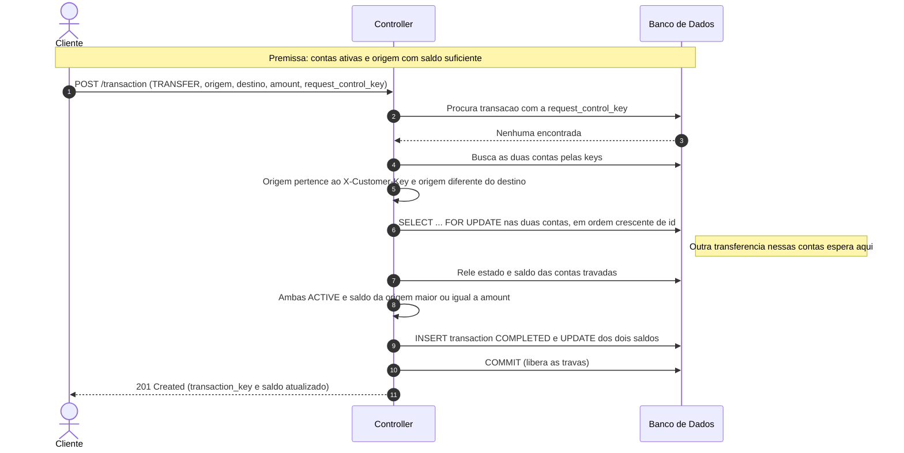

**Transferência — falha: saldo insuficiente**

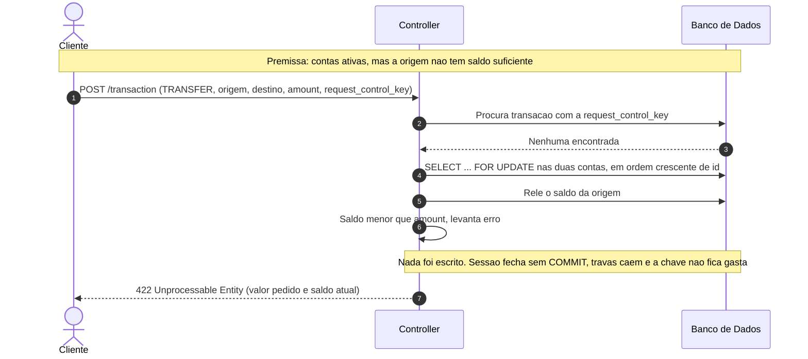

**Transferência — falha: a mesma requisição chega duas vezes**

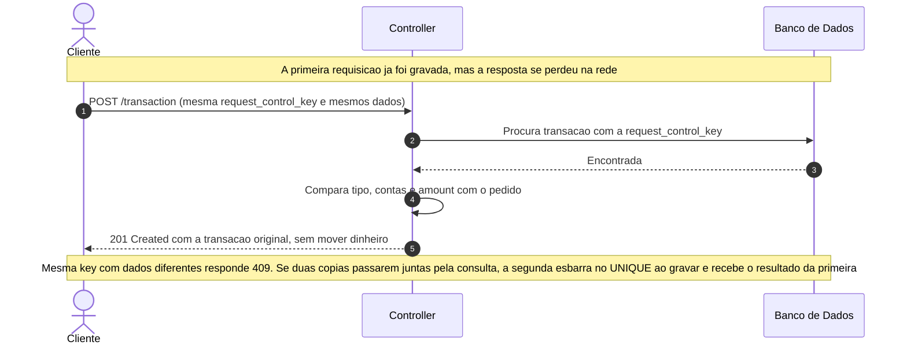

**Encerramento de conta — falha: conta com saldo**

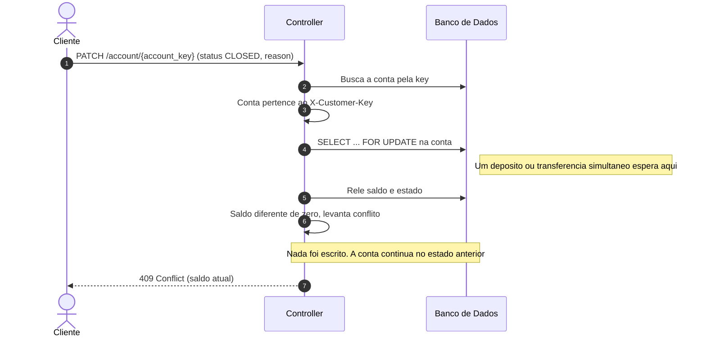

**Pagamento de boleto — caminho feliz**

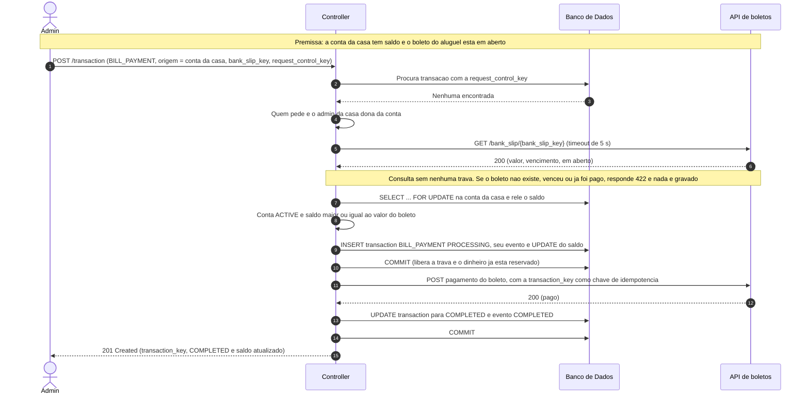

**Pagamento de boleto — falha: a API de boletos não responde**

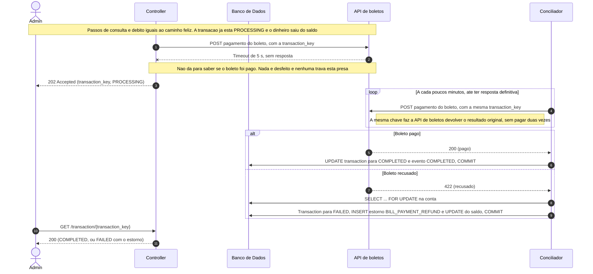

#### Fase 2 — república

**Geração automática das contas fixas — caminho feliz (e rodando duas vezes)**

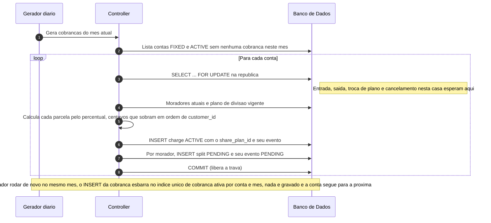

**Lançamento de conta variável — caminho feliz**

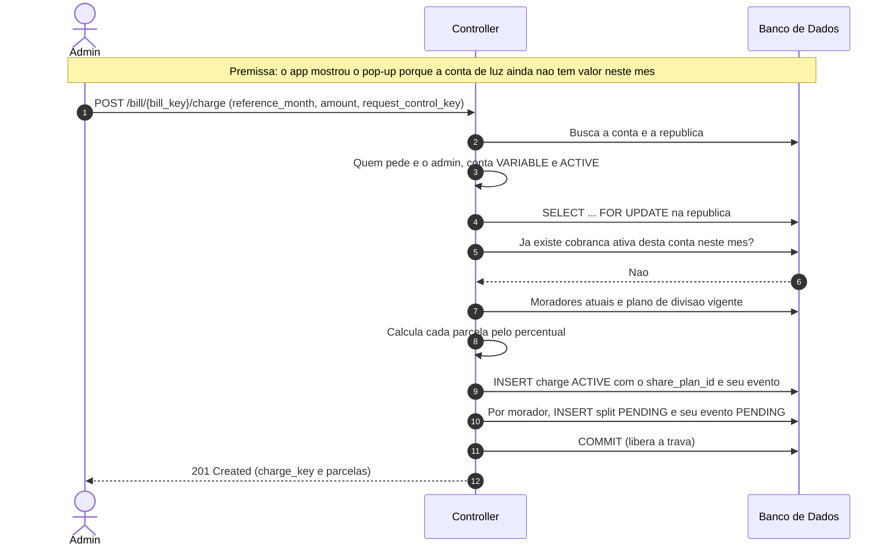

**Novo plano de divisão — falha: percentuais que não fecham**

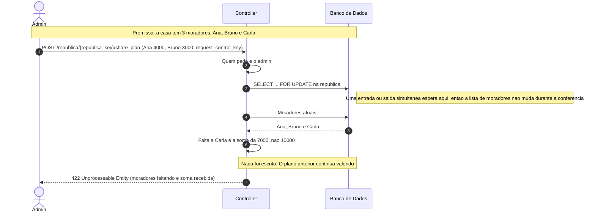

**Pagamento de parcela — caminho feliz**

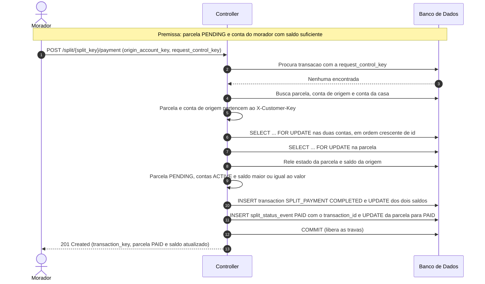

**Pagamento de parcela — falha: dois pagamentos da mesma parcela ao mesmo tempo**

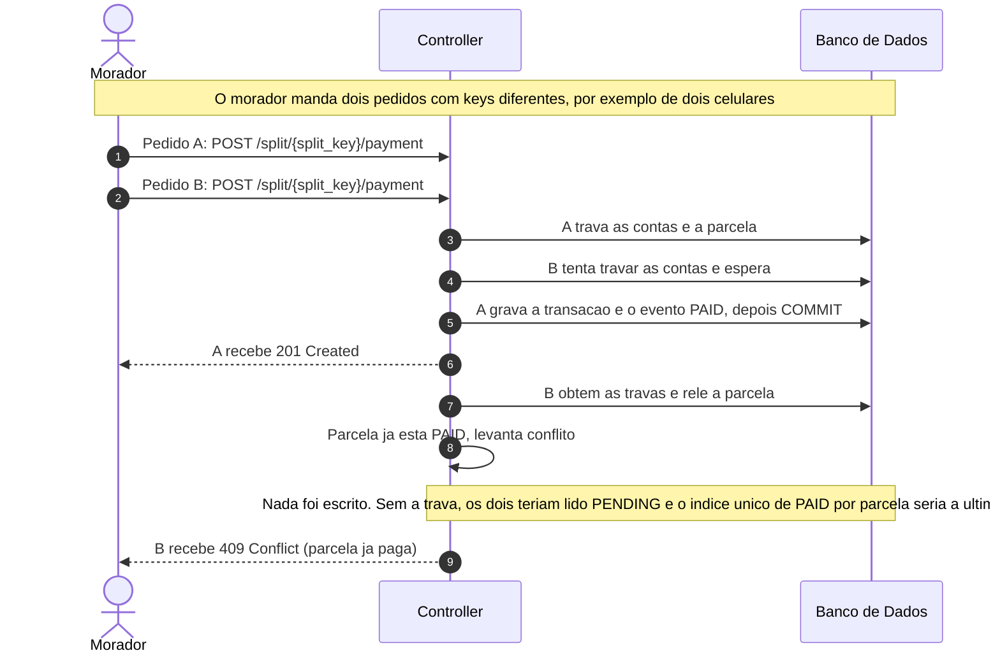

**Cancelamento de cobrança — falha: uma parcela já foi paga**

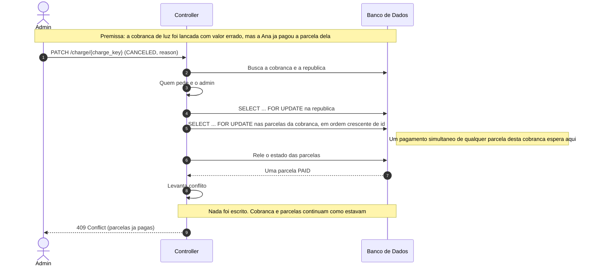

**Troca de admin — caminho feliz (o admin quer sair da casa)**

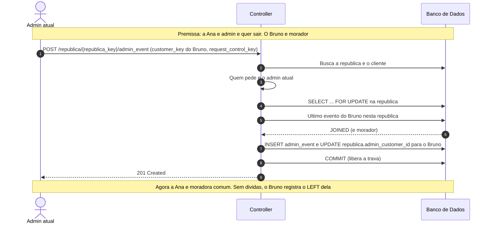

**Saída de morador — falha: dívida pendente**

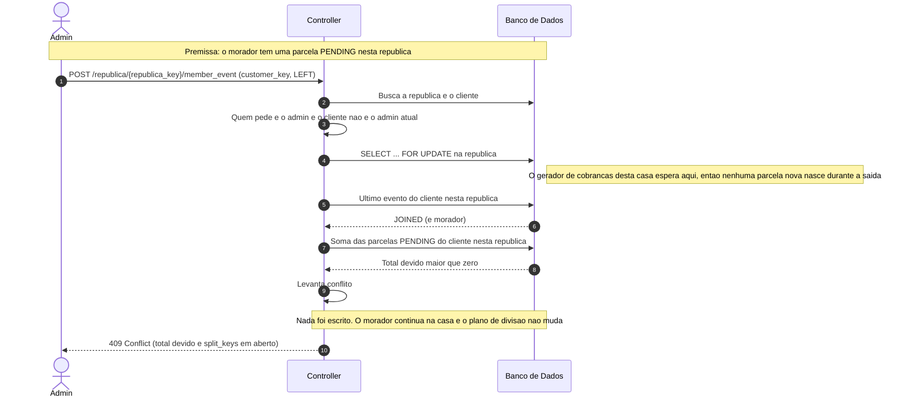

**Entrada de morador — falha: o cliente já mora em outra república**

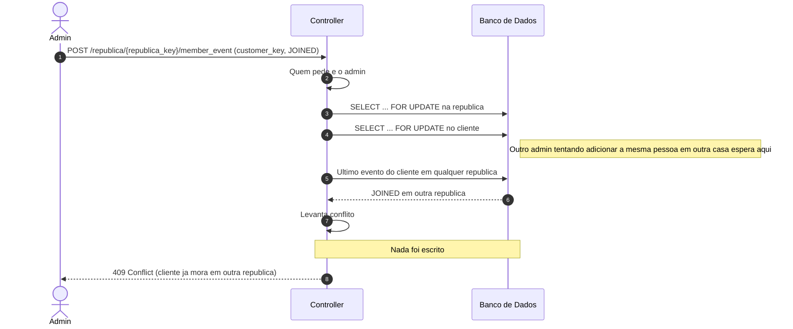

> ## Principal desafio — Fase 1
>
> - **Qual é:** manter o saldo certo quando várias transferências mexem nas mesmas contas ao mesmo tempo, quando a mesma requisição chega duas vezes e quando o dinheiro depende de um serviço de fora que pode não responder.
> - **Por que é difícil:** a solução óbvia (ler o saldo, conferir, gravar) quebra quando duas transferências leem o mesmo saldo antes de qualquer uma gravar: as duas passam na conferência e a conta fica negativa. Travar resolve isso, mas cria outro risco: a transferência A→B trava A e espera B, enquanto B→A trava B e espera A, e as duas ficam paradas para sempre (deadlock). A requisição repetida por queda de rede é o mesmo problema visto de outro ângulo: duas cópias da mesma operação disputando as mesmas linhas. E no boleto há uma tensão a mais: travar a conta durante a chamada externa pararia a conta, mas debitar depois de pagar arrisca pagar um boleto sem ter o dinheiro.
> - **Como o desenho resolve:** trava pessimista nas contas, sempre em ordem crescente de `id`, então toda operação disputa as linhas na mesma sequência e o ciclo do deadlock não se forma. Depois da trava, tudo é relido; nada é escrito antes da última conferência; e cada operação termina num único commit. A `request_control_key` com `UNIQUE` impede que uma repetição, mesmo simultânea, mova dinheiro duas vezes. No boleto, o débito acontece primeiro, num commit curto, e a chamada externa só depois, sem trava; a resposta que não chega deixa a transação em `PROCESSING`, e o conciliador repete a chamada com a mesma chave até ter uma resposta definitiva. `CHECK balance >= 0` é a última barreira, caso o código erre. Os testes disparam transferências em paralelo, só por HTTP, e conferem que o saldo nunca fica negativo e que a soma das transações de cada conta bate com o saldo dela.

> ## Principal desafio — Fase 2
>
> - **Qual é:** garantir que cada cobrança vire as parcelas certas, nos valores certos, para os moradores certos, uma vez só, com moradores entrando e saindo, o admin trocando os percentuais, o gerador automático rodando, cobranças sendo canceladas e pagamentos acontecendo ao mesmo tempo.
> - **Por que é difícil:** a lista de moradores e o plano de divisão não são colunas, são o resultado de consultas sobre eventos e planos, e podem mudar no meio de uma operação. Se o gerador lê a lista enquanto o admin remove alguém, o morador pode sair e logo depois receber uma parcela de uma casa onde não mora mais; se lê o plano enquanto o admin troca os percentuais, pode dividir por um plano que já não vale. Se o gerador roda duas vezes, a casa recebe o aluguel em dobro. Se o admin cancela a cobrança enquanto um morador paga a parcela dela, o dinheiro entra na casa por uma cobrança que deixou de existir. E dois pagamentos da mesma parcela, lidos ao mesmo tempo, quitariam a parcela duas vezes.
> - **Como o desenho resolve:** toda operação que lê ou muda moradores, admin, plano ou cobranças trava primeiro a linha da república, então elas acontecem uma de cada vez em cada casa. Entrada e saída criam o novo plano no mesmo commit, então nunca existe plano que não feche com os moradores. A cobrança guarda o plano que usou, e a soma das parcelas fecha sempre com o valor. O índice único de cobrança ativa por conta e mês faz o gerador poder rodar quantas vezes for preciso, e `UNIQUE(charge_id, customer_id)` impede duas parcelas da mesma pessoa na mesma cobrança. O cancelamento trava as parcelas antes de conferir se alguma foi paga, e o pagamento trava a parcela antes de conferir se ela segue `PENDING`, então um dos dois sempre vê o resultado do outro. O índice único que aceita no máximo um evento `PAID` por parcela é a última barreira. Todas as travas seguem a mesma ordem global (república → cliente → contas → parcelas), então nenhuma operação fica esperando outra para sempre.
